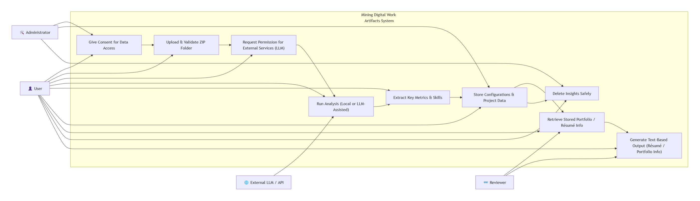
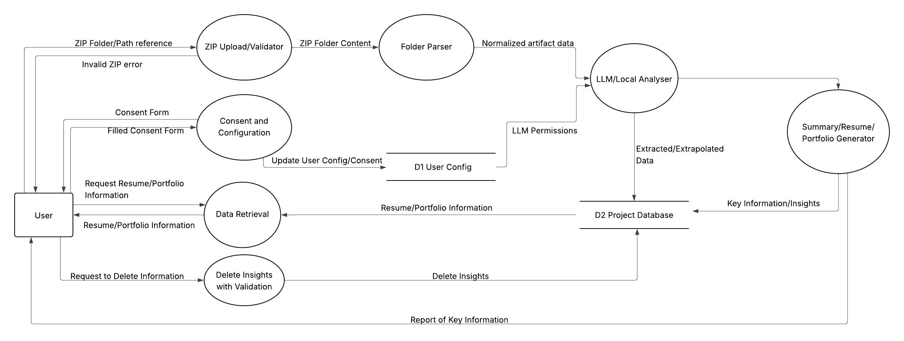

[](https://classroom.github.com/online_ide?assignment_repo_id=20510468&assignment_repo_type=AssignmentRepo)
# Project-Starter
Please use the provided folder structure for your project. You are free to organize any additional internal folder structure as required by the project. 

```
.
├── docs                    # Documentation files
│   ├── contract            # Team contract
│   ├── proposal            # Project proposal 
│   ├── design              # UI mocks
│   ├── minutes             # Minutes from team meetings
│   ├── logs                # Team and individual Logs
│   └── ...          
├── src                     # Source files (alternatively `app`)
├── tests                   # Automated tests 
├── utils                   # Utility files
└── README.md
```

Please use a branching workflow, and once an item is ready, do remember to issue a PR, review, and merge it into the master branch.
Be sure to keep your docs and README.md up-to-date.

# Project Diagrams
## System Architecture Diagram


The **System Architecture Diagram** above represents the core workflow of the *Mining Digital Work Artifacts System*, showing the interaction between users, administrators, reviewers, and external services.  

### Overview  
The system facilitates the secure extraction of professional insights (résumé or portfolio information) from digital work artifacts. It emphasizes **data privacy, consent management, and controlled use of external AI services (LLMs)**.

## Project Milestones

### Milestone #1 (October-December 07) - **CURRENT FOCUS**
**Goal:** Create functionality for parsing and outputting information correctly
**Output:** Text-based (CSV, JSON, plain text)
**Key Features:**
- User consent for data access
- ZIP file parsing and validation
- Project analysis and metrics extraction
- Database storage
- Text-based output generation

### Milestone #2 (January-March 05) - **PLANNED**
**Goal:** API service with human-in-the-loop process
**Key Features:**
- Incremental file addition
- Duplicate file recognition
- User customization and corrections
- Project re-ranking and selection
- Role and success evidence incorporation
- Image association for projects
- Portfolio showcase customization
- Résumé item customization
- Display portfolio and résumé information

### Milestone #3 (March-April 05) - **PLANNED**
**Goal:** Front-end user interface
**Key Features:**
- One-page résumé generation
- Web portfolio with timeline and heatmap
- Top 3 projects showcase
- Private/public dashboard modes
- Interactive customization

### Main Components  
1. **Actors**
   - **Administrator** – Manages data access permissions and overall system governance.  
   - **User** – Provides data (e.g., ZIP folders), grants permissions, and retrieves results.  
   - **Reviewer** – Evaluates generated outputs for accuracy and relevance.  
   - **External LLM/API** – Supports AI-assisted analysis when user consent allows.  

2. **Core Processes**
   - **Give Consent for Data Access** – Ensures user and admin authorization before any processing.  
   - **Upload & Validate ZIP Folder** – Users upload their work data, which the system validates.  
   - **Request Permission for External Services (LLM)** – Manages consent for sending data to external AI systems.  
   - **Run Analysis (Local or LLM-Assisted)** – Executes data mining to extract metrics and skills.  
   - **Extract Key Metrics & Skills** – Summarizes user competencies and project patterns.  
   - **Store Configurations & Project Data** – Saves extracted insights, maintaining confidentiality.  
   - **Retrieve Stored Portfolio / Résumé Info** – Allows users or reviewers to fetch stored insights.  
   - **Generate Text-Based Output** – Produces structured résumé or portfolio summaries.  
   - **Delete Insights Safely** – Ensures data can be removed securely without leaving residual traces.  

3. **Data Flow**
   - **Inputs:** User uploads (ZIP files) and consent records.  
   - **Processing:** Validation → Analysis → Storage → Output generation.  
   - **Outputs:** Structured resume/portfolio insights.  
   - **Feedback Loop:** Reviewers and users can trigger re-analysis or deletion requests.  

This architecture ensures transparency, modularity, and privacy compliance while leveraging AI tools responsibly to analyze digital work artifacts.

## Level 1 Data Flow Diagram


The link for the same DFD can be viewed using this [link](https://lucid.app/lucidchart/c9654f3d-90ee-4b90-83d7-652ac1448dad/edit?viewport_loc=-76%2C-92%2C2911%2C1466%2C6~KY3uEuKYee&invitationId=inv_5a51ab76-9aa7-4549-b897-4f521982137b).

### Explanation:
The Level-1 DFD shows the internal data flows and subprocesses within the **Mining Digital Work Artifacts** system.  
It highlights how user inputs (ZIP folders and consent) move through validation, analysis, and reporting to generate résumé and portfolio insights, while maintaining user privacy and configurability. Here is an explanation for the main components of the diagram:

#### 1. **User**
Interacts with the system by:
- Uploading ZIP folder/path references  
- Granting or denying data access/LLM permissions  
- Requesting résumé or portfolio data  
- Deleting stored insights  

#### 2. **ZIP Upload / Validator**
Validates the uploaded ZIP.  
- If valid, it passes content to `Folder Parser`  
- Otherwise, it returns an error  

#### 3. **Folder Parser**
Unpacks the ZIP and normalizes artifacts into structured metadata.

#### 4. **Consent and Configuration**
Captures user consent and configuration settings (privacy preferences, LLM usage) and updates **D1 User Config**.

#### 5. **LLM / Local Analyser**
Analyzes normalized data:
- Checks LLM permissions and uses LLMs if permitted  
- Falls back to local analysis otherwise  
- Extracts project metrics, extrapolation of individual contributions, timelines, and skills  
- Stores results in **D2 Project Database**

#### 6. **Summary / Portfolio Generator**
Generates summarized project insights, ranked contributions, and résumé-ready highlights.

#### 7. **Data Retrieval**
Fetches stored résumé/portfolio data from the project database when requested.

#### 8. **Delete Insights with Validation**
Processes deletion requests and ensures shared data across reports is preserved.

#### Data Stores
- **D1 User Config** → stores consent and user preferences  
- **D2 Project Database** → stores extracted project insights and summaries  

## Getting Started

### Current Capabilities (Milestone #1)
The system currently supports:
- ZIP file parsing and metadata extraction
- Basic file type detection
- Docker containerization

### Prerequisites
- Python 3.10+
- Docker (optional)

### Installation
```bash
# Clone the repository
git clone <repository-url>
cd capstone-project-team-14

# Install dependencies
pip install -r requirements.txt

# Run the application
python -m src.main
```

### Docker
```bash
# Build and run with Docker
docker-compose up
```

## API Reference

This section is WIP and will be refined as apart of Milestone #2

#### Configuration
- `POST /config/scan` - Create scan configuration
- `GET /config/scan` - Get current configuration

#### File Processing
- `POST /scan/start` - Start scanning a ZIP file
- `GET /scan/status` - Check scan progress

#### Insights
- `GET /insights/summary` - Get project summary

#### Export
- `POST /export/json` - Export data as JSON
- `POST /export/csv` - Export data as CSV


--------
# Work Breakdown Structure (WBS)
## Mining Digital Work Artifacts System
### Team 14: Privacy-First Portfolio Mining Pipeline

---

## 1.0 Project Management
### 1.1 Project Planning
-  Define project charter and scope statement
- Create detailed project schedule with milestones
- Develop risk management plan
- Establish communication protocols
- Define success metrics and KPIs

### 1.2 Team Coordination
- Conduct weekly team meetings
- Maintain project documentation repository
- Track task assignments and progress
- Manage inter-component dependencies
- Coordinate integration points between modules

### 1.3 Stakeholder Management
- Identify and document stakeholder requirements
- Conduct regular progress reviews
- Manage feedback and change requests
- Prepare and deliver status reports

---

## 2.0 Requirements Analysis & Design
### 2.1 Requirements Gathering
- Document functional requirements (FR-1 through FR-10)
- Document non-functional requirements (NFRs)
- Create requirements traceability matrix
- Validate requirements with stakeholders
- Baseline requirements documentation

### 2.2 System Architecture Design
- Design overall system architecture
- Create component interaction diagrams
- Design data flow diagrams (Level 0, Level 1)
- Define API contracts and interfaces
- Document technology stack decisions

### 2.3 Database Design
- Design normalized database schema
- Create entity-relationship diagrams
- Define indexes and optimization strategies
-  Design audit log structure
- Plan data retention and purge strategies

### 2.4 Security & Privacy Design
- 2.4.1 Design redaction rule engine
- 2.4.2 Define PII detection patterns
- 2.4.3 Create privacy-preserving data flow
- 2.4.4 Design consent management system
- 2.4.5 Document security best practices

---

## 3.0 Scanner & Configuration Module
### 3.1 Configuration Management
- Implement configuration file parser
- Build configuration validation logic
- Create allowlist/denylist processor
- Implement file size and type limits
- Build configuration persistence layer

### 3.2 File System Scanner
- Implement directory traversal algorithm
- Build file enumeration service
- Create progress tracking mechanism
- Implement exclusion pattern matcher
- Add symbolic link and mount point handling

### 3.3 ZIP Upload Validator
- Implement ZIP file validation
- Build extraction service
- Create temporary storage manager
- Implement malware scanning hooks
- 3Add compression bomb detection

### 3.4 File Type Detection
- Implement MIME type detection
- Build file signature analyzer
- Create extension mapping service
- Implement content-based detection fallback
- Build adapter routing logic

---

## 4.0 Adapter Framework
### 4.1 Adapter Interface Design
- Define base adapter abstract class
- Create adapter registration system
- Implement adapter factory pattern
- Build adapter configuration management
- Create adapter testing framework

### 4.2 Git Repository Adapter
- Integrate GitPython/pydriller libraries
- Implement commit history extraction
- Build contributor analysis logic
- Extract branch and tag information
- Calculate code churn metrics
- Implement language detection
- Build timeline generation

### 4.3 Document Adapters
- 4.3.1 **Word Document Adapter (docx)**
  - Integrate python-docx library
  - Extract document metadata
  - Implement word/page counting
  - Extract revision history
  - Build content summarization
- 4.3.2 **PowerPoint Adapter (pptx)**
  - Integrate python-pptx library
  - Extract slide count and structure
  - Implement content extraction
  - Build presentation metadata parser
- 4.3.3 **PDF Adapter**
  - Integrate pdfminer library
  - Extract text and metadata
  - Implement page analysis
  - Build form field detection

### 4.4 Media/Design File Adapters
- Implement image metadata extraction (EXIF)
- Build video/audio duration extraction (ffprobe)
- Extract resolution and codec information
- Implement design file basic metadata parsing
- Build thumbnail generation service

### 4.5 Fallback Adapter
- Implement generic file metadata extraction
- Build basic file statistics collector
- Create unsupported file type handler

---

## 5.0 Data Processing Pipeline
### 5.1 Normalizer Component
- Design unified data schema
- Implement schema mapping logic
- Build data transformation pipelines
- Create field standardization rules
- Implement data validation layer

### 5.2 Deduplication System
- Implement file hashing (SHA-256)
- Build hash comparison engine
- Create duplicate detection algorithm
- Implement merge strategy for duplicates
- Build duplicate reporting mechanism

### 5.3 Redaction Engine
- Implement regex-based redaction rules
- Build PII detection patterns
  - Email address detection
  - Phone number detection
- Create field-level redaction logic
- Implement configurable redaction policies
- Build redaction preview system
- Create redaction audit trail

### 5.4 Data Storage Layer
- Implement SQLAlchemy ORM models
- Build database connection pool
- Create transaction management
- Implement batch insert optimization
- Build database migration system

---

## 6.0 Analytics & Insights Engine
### 6.1 Local Analysis Engine
- Implement contribution timeline calculator
-Build project activity heatmap generator
- Create skill extraction algorithm
- Implement streak detection logic
- Build technology stack analyzer

### 6.2 LLM Integration (Optional)
- Design LLM consent checking system
- Implement LLM API integration layer
- Build prompt engineering templates
- Create response parsing logic
- Implement fallback to local analysis

### 6.3 Metrics Aggregation
- Build project summary statistics
- Implement contribution scoring algorithm
- Create ranking and prioritization logic
- Build cross-project analytics
- Implement time-series analysis

### 6.4 Portfolio Generation
- Design portfolio data structure
- Implement project highlight extraction
- Build résumé-ready content formatter
- Create skill categorization system
- Implement achievement detection

---

## 7.0 API Development
### 7.1 FastAPI Service Setup
- Initialize FastAPI application
- Configure middleware and CORS
- Implement dependency injection
- Set up request/response validation
- Configure API documentation (Swagger/OpenAPI)

### 7.2 REST Endpoints Implementation
- 7.2.1 **Configuration Endpoints**
  - POST /config/scan - Create scan configuration
  - GET /config/scan - Retrieve configurations
  -  PUT /config/scan - Update configuration
  - DELETE /config/scan - Delete configuration
- 7.2.2 **Scanning Endpoints**
  - POST /scan/start - Initiate scan
  - GET /scan/status - Check scan progress
  - POST /scan/cancel - Cancel running scan
- 7.2.3 **Artifact Endpoints**
  - GET /artifacts - List all artifacts
  - GET /artifacts/{id} - Get artifact details
  - DELETE /artifacts/{id} - Remove artifact
- 7.2.4 **Insights Endpoints**
  - GET /insights/summary - Get overall summary
  - GET /insights/timeline - Get contribution timeline
  - GET /insights/skills - Get extracted skills
  - GET /insights/projects - Get project analytics
- 7.2.5 **Export Endpoints**
  - POST /export/json - Export as JSON
  - POST /export/csv - Export as CSV
  - POST /export/pdf - Export as PDF
- 7.2.6 **Privacy Endpoints**
  - GET /privacy/settings - Get privacy settings
  - PUT /privacy/settings - Update settings
  - POST /privacy/purge - Purge data

### 7.3 Authentication & Authorization
- Implement API key management
- Build rate limiting middleware
- Create access control logic
- Implement audit logging for API calls

---

## 8.0 Export & Reporting Module
### 8.1 Export Format Handlers
- 8.1.1 **JSON Exporter**
  - Design JSON schema
  - Implement serialization logic
  - Build schema validation
- 8.1.2 **CSV Exporter**
  - Design CSV structure
  - Implement flattening logic
  - Build CSV writer with encoding support
- 8.1.3 **PDF Exporter**
  - Design PDF template
  - Implement PDF generation (ReportLab)
  - Build chart and graph rendering
  - Create styling and formatting

### 8.2 Report Templates
- Create résumé summary template
- Build portfolio overview template
- Design project detail template
- Implement contribution report template
- Create skills matrix template

### 8.3 Data Filtering & Scoping
- Implement time window filtering
- Build project selection logic
- Create skill category filtering
- Implement contribution threshold filtering

---

## 9.0 Testing & Quality Assurance
### 9.1 Unit Testing
- Write adapter unit tests
- reate redaction engine tests
- Build configuration parser tests
- Implement normalizer tests
- Write API endpoint unit tests

### 9.2 Integration Testing
- Create end-to-end scan tests
- Build deduplication integration tests
- Implement full pipeline tests
- Create export workflow tests
- Build error handling scenario tests

### 9.3 Performance Testing
- Create large file handling tests
- Build concurrent scan tests
- Implement memory usage tests
- Create database performance tests

### 9.4 Security Testing
- Implement PII redaction verification
- Create injection attack tests
- Build access control tests
- Implement data leakage tests

### 9.5 User Acceptance Testing
- Create test scenarios document
- Build sample test datasets
- Conduct privacy settings testing
- Perform export validation testing
- Execute cross-platform testing

---

## 10.0 Infrastructure & DevOps
### 10.1 Development Environment
- Set up Python 3.11 environment
- Configure virtual environments
- Install and configure dependencies
- Set up IDE configurations
- Create development database instances

### 10.2 CI/CD Pipeline
- Configure GitHub Actions/GitLab CI
- Implement automated testing pipeline
- Set up code coverage reporting
- Configure linting and type checking
- Build automated deployment scripts

### 10.3 Containerization
- Create Docker images
- Write docker-compose configuration
- Implement container orchestration
- Build volume management for data persistence

### 10.4 Monitoring & Logging
- Implement application logging
- Set up error tracking
- Create performance monitoring
- Build audit log system
- Implement health check endpoints

---

## 11.0 Documentation
### 11.1 Technical Documentation
- Write API documentation
- Create adapter development guide
- Document database schema
- Write architecture decision records
- Create troubleshooting guide

### 11.2 User Documentation
- Write installation guide
- Create user manual
- Develop quick start guide
- Write privacy configuration guide
- Create FAQ document

### 11.3 Developer Documentation
- Write code contribution guidelines
- Create coding standards document
- Document testing procedures
- Write plugin development guide
- Create API integration examples

---

## 12.0 Deployment & Release
### 12.1 Release Preparation
- Conduct final integration testing
- Perform security audit
- Complete documentation review
- Create release notes
- Package distribution artifacts

### 12.2 Deployment Execution
- Deploy to production environment
- Run smoke tests
- Verify all endpoints
- Validate data persistence
- Confirm export functionality

### 12.3 Post-Deployment
- Monitor system performance
- Collect user feedback
- Address immediate issues
- Plan maintenance schedule
- Document lessons learned

---

## 13.0 Project Closure
### 13.1 Final Deliverables
- Compile final project report
- Create technical handover document
- Prepare demonstration materials
- Archive project artifacts
- Submit final codebase

### 13.2 Knowledge Transfer
- Conduct handover sessions
- Create maintenance guide
- Document known issues and roadmap
- Transfer ownership of repositories
- Provide support contact information

---
