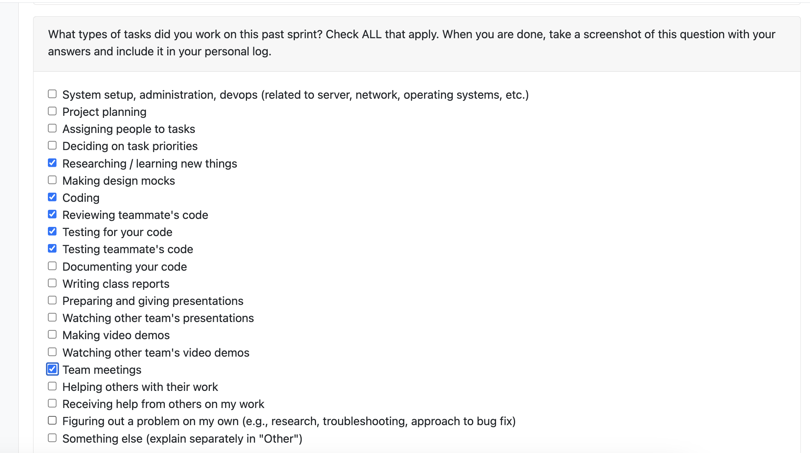
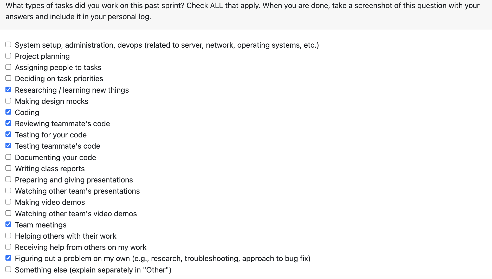

# Individual Log – Abdur Rehman
1. [Week 3](#week-3)
1. [Week 4](#week-4)
1. [Week 5](#week-5)
1. [Week 6](#week-6)
1. [Week 7](#week-7)
1. [Week 8](#week-8)
1. [Week 9](#week-9)

## Week 3 

### 1. Type of Tasks Worked On
  

---

### 3. Recap of Weekly Goals
This week focused on foundational project requirement work. I assisted in the following:
- outlining the artifact collection features (directory scanning, file filtering, and metadata)
- drafting the artifact analysis requirements (classification and basic statistics)
- reviewing the dashboard and visualization requirements for summary metrics

---

### 4. Features Owned in Project Plan
- N/A

---

### 5. Tasks from Project Board Associated with These Features
- N/A

---

### 6. Tasks Completed / In Progress in the Last 2 Weeks
| Task ID | Issue Title | Status       | Notes |
|--------|-------------|-------------|-------|
| N/A    | N/A         | N/A         | N/A   |

---

### 7. Additional Context
N/A

---

## Week 4
This section outlines the individual log for week 4

### September 22 - September 28

### Tasks

### Weekly Goals

1. My Features: 
    - Connected project requirements to the architecture layout.
    - Polished and expanded the requirements section for the proposal.

2. Associated Tasks
    - Refining and writing project proposal.

3. Completed/In-Progress
    - Finalized the requirements and proposal write-up.

## Week 5
This section outlines the individual log for week 5

### September 29 - October 5

### Tasks

### Weekly Goals

1.Weekly Goals

My Focus Areas:

Develop Level 0 and Level 1 Data Flow Diagrams (DFDs)

2.Related Tasks:

Work on creating and refining the Data Flow Diagram

3.Progress Summary:

Finished the Level 0 DFD

Completed the Level 1 DFD
---

## Week 6
This section outlines the individual log for week 6

### October 6 - October 12

### Tasks

### Weekly Goals

1. My Features: 
    - Create and revise WBS chart based on project updates

2. Associated Tasks
    - Work Breakdown Structure

3. Completed/In-Progress
    - Completed initial WBS chart
    - Revised WBS chart according to updated project requirements

## Week 7 – October 13 to October 19

### 1. Type of Tasks Worked On

---

### 3. Recap of Weekly Goals
This week focused on developing and testing the consent management functionality for the system.
My main contributions included:

-implementing the User Directory Consent Manager module to handle user consent for directory data access

- writing and running unit tests to verify consent operations such as grant, revoke, and reset

- designing the system to be compatible with future modules like LLM access consent and external data analysis
---

### 4. Features Owned in Project Plan
- User Consent – Directory Access  
- Consent Management Module  

---

### 5. Tasks from Project Board Associated with These Features
- User Consent – Directory Access (#16)  
 

---

### 6. Tasks Completed / In Progress in the Last 2 Weeks
| Task ID | Issue Title                           | Status       | Notes |
|----------|---------------------------------------|--------------|-------|
| 16     | User Consent – Directory Access | Completed  | 
---

### 7. Additional Context
- All tests for the User Directory Consent Manager passed successfully after debugging one write-handling issue.

- Code was structured to integrate easily with future LLM access consent and external analysis features.

- Continued documenting and refining the module for clarity and maintainability.

## Week 8
This section outlines the individual log for week 7

### October 20 - October 26

### Tasks

### Weekly Goals

1. My Features:
    - Implement a comprehensive PNG/JPEG Image Processor capable of extracting detailed metrics from image files
    - Build full unit test coverage and documentation
    - Integrate batch image analysis functionality
    - Improve code performance for color and brightness analysis

2. Associated Tasks
    - Develop ImageProcessor class with all metric extraction methods
    - Implement methods for:
        - Resolution, aspect ratio, file stats, brightness, and color analysis
        - EXIF metadata extraction and edit frequency tracking
    - Create automated tests covering all major and edge cases
    - Write complete API documentation and example usage scripts
    - Update requirements.txt with necessary dependencies (Pillow, NumPy)

3. Completed/In-Progress
    - src/image_processor.py 
        - Implemented ImageProcessor class with all core metric extraction features
        - Added full error handling, logging, and validation
    - tests/test_image_processor.py 
        - Added 24 comprehensive unit tests
        - Verified edge cases and error conditions
        - All tests passing 
    - docs/IMAGE_PROCESSOR.md 
        - Full API documentation
        - Usage examples, return structures, and detailed metric descriptions
    - src/image_processor_example.py 
        - Demonstrates single and batch image analysis
    

### Reflection Points

**What went well:**
- Successfully implemented a fully functional and modular image processor
- Achieved 100% test coverage with well-structured, maintainable tests
- Documentation provides clear guidance for both users and developers
- Batch processing feature optimized for speed and memory efficiency

**What didn't go well:**
- Initial dominant color extraction was slow — required optimization using image resizing
- Documentation took longer than planned due to scope and completeness goals
- Some EXIF data parsing inconsistencies between image formats

### Planning Activities for Next Cycle

**Week 9 Goals:**
- Most likely will take on more of a dev role next week to start implementing features.
- Review and refine issue descriptions based on team feedback
- Begin sprint planning with team for Milestone #1 deliverables
- Focus on core infrastructure components that other features depend on

## Week 9
This section outlines the individual log for week 9

### October 27 - November 2

### Tasks

### Weekly Goals

1. **My Features:**
   - Transform the Image Processor into a full **content analysis system** capable of understanding and describing image contents.  
   - Extend functionality to detect and classify faces, text, shapes, patterns, and textures.  
   - Integrate OCR (Tesseract) and shape/edge analysis for enhanced content understanding.  
   - Add classification logic for different image types such as portraits, documents, screenshots, and diagrams.  
   - Ensure all features run locally with no external AI API dependencies.  

2. **Associated Tasks**
   - Implement new analysis methods in `src/image_processor.py`:  
     - `detect_edges()`, `detect_shapes()`, `extract_text()`, `detect_faces()`, `analyze_texture()`, `detect_patterns()`, `classify_content_type()`, and `get_key_features()`.  
   - Add new libraries: `opencv-python`, `pytesseract`, `scikit-image`, and `pyzbar`.  
   - Create structured output returning both technical and content-based insights.  
   - Develop and run example scripts to demonstrate single and batch image analysis.  

3. **Completed/In-Progress**
   - Enhanced `ImageProcessor` to analyze not just metrics but also **meaningful visual content** (faces, text, shapes, patterns).  
   - Integrated **OCR-based text extraction**, **Haar Cascade face detection**, and **GLCM texture analysis**.  
   - Implemented **edge and shape detection** to analyze composition and complexity.  
   - Added **classification logic** to describe images in natural language (e.g., “group photo” or “document scan”).  
   - Updated requirements and documentation with new dependencies and setup instructions.  

### Reflection Points

**What went well:**
- The image processor was successfully upgraded into a full content understanding module.  
- Integration of face detection, OCR, and texture analysis greatly improved the system’s descriptive power.  
- Local-only implementation avoids reliance on cloud APIs while maintaining strong accuracy and speed.  
- Testing and documentation were thorough, covering all major features and use cases.  

**What didn’t go well:**
- Some image types (especially complex diagrams) required parameter tuning for accurate shape detection.  
- Tesseract OCR performance varied with image quality, requiring preprocessing improvements.  
- Initial runs were slower before optimization of resizing and color analysis functions.  

### Planning Activities for Next Cycle

**Week 10 Goals:**
- Begin integrating the **Image Processor** output with the unified reporting pipeline.  
- Add visualization and summary metrics to reports (e.g., charts showing detected faces or color profiles).  
- Optimize performance for batch image analysis.  
- Prepare module for final milestone integration and peer testing.

## Week 10
This section outlines the individual log for week 10

### November 3 – November 9

### Tasks

### Weekly Goals

1. **My Features:**
   - Extend the **Skill Extraction System** to perform deep analysis of code artifacts across multiple languages.  
   - Move beyond surface-level detection to infer developer reasoning, optimization awareness, and design principles.   
   - Implement a unified, multi-language skill detector capable of analyzing **Python, Java, C, C++, JavaScript**, and others.  

2. **Associated Tasks:**
   - Enhance `advanced_skill_extractor.py` to support structural and regex-based code analysis.  
   - Implement detection of:  
     - **Design patterns** (Strategy, Dependency Injection, Custom Exception Hierarchies)  
     - **Algorithmic optimizations** (e.g., O(n²) → O(n), set-based lookups)  
     - **Type safety and resource management** (type hints, RAII, smart pointers)  
   - Add test coverage for all supported languages in `test_advanced_skill_extractor.py`.  
   - Maintain total line additions under 500 while improving coverage and accuracy.  

### Reflection Points

**What went well:**
- Successfully implemented deep, multi-language skill detection while staying under the code limit.  
- Maintained strong test coverage and structured design.  
- Achieved full local analysis—no external dependencies required.  
- Clear commit history and clean branch ready for integration.  

**What didn’t go well:**
- Regex based detection for C and C++ required fine tuning to avoid false positives.  
- Balancing detection accuracy across languages introduced some complexity in test maintenance.   

### Planning Activities for Next Cycle

**Week 11 Goals:**
- Integrate the **Skill Extraction System** with the **report generation module** for combined analytics.  
- Add visualization tools to represent detected skills and code quality metrics.  
- Enhance configuration flexibility (language detection thresholds, rule customization).  
- Prepare branch for peer review and merge into the main development pipeline.
