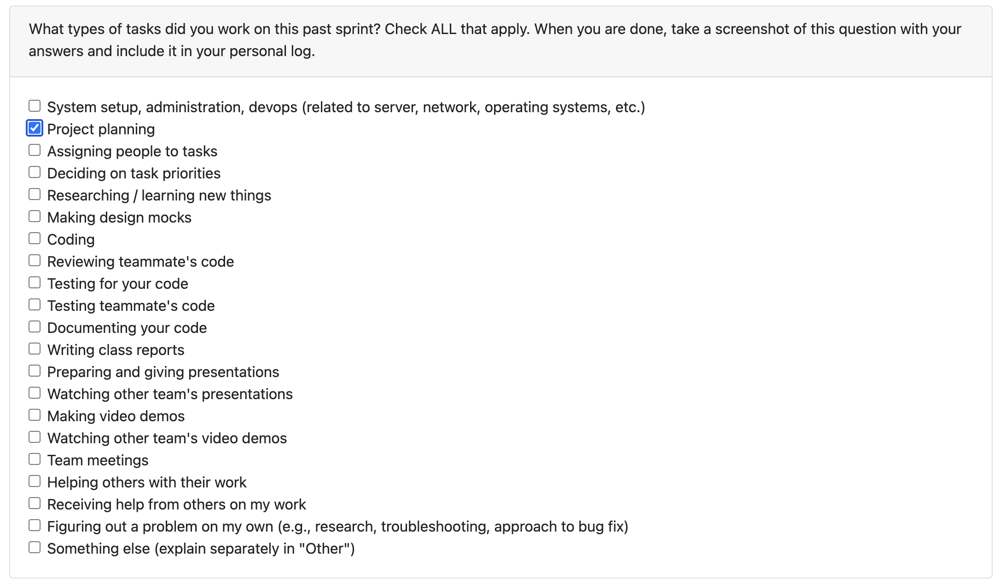
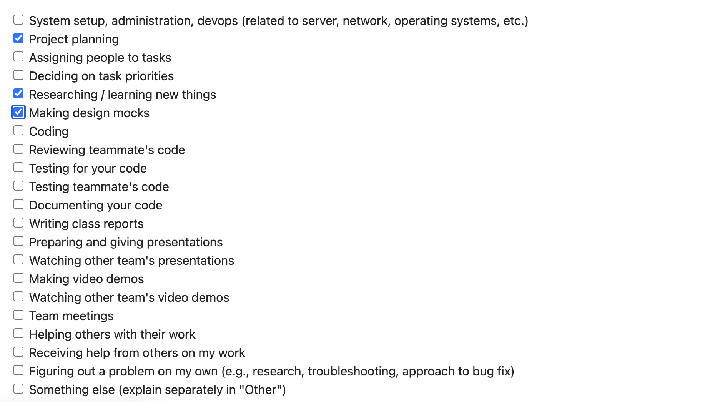
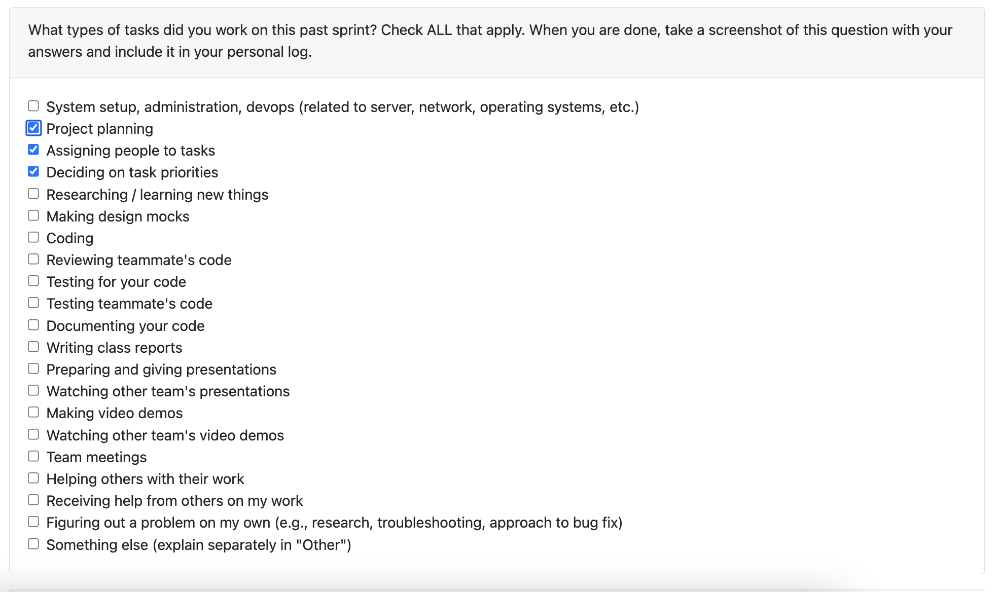
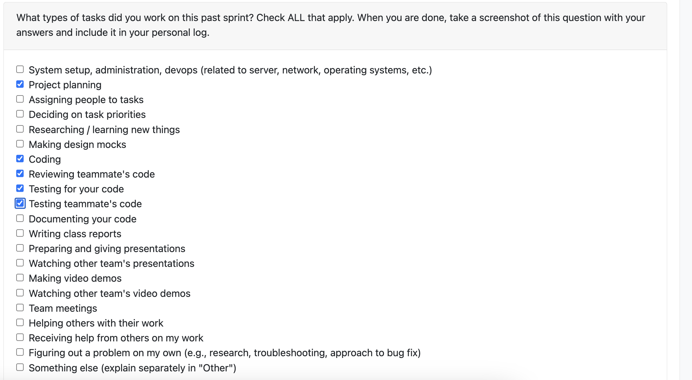
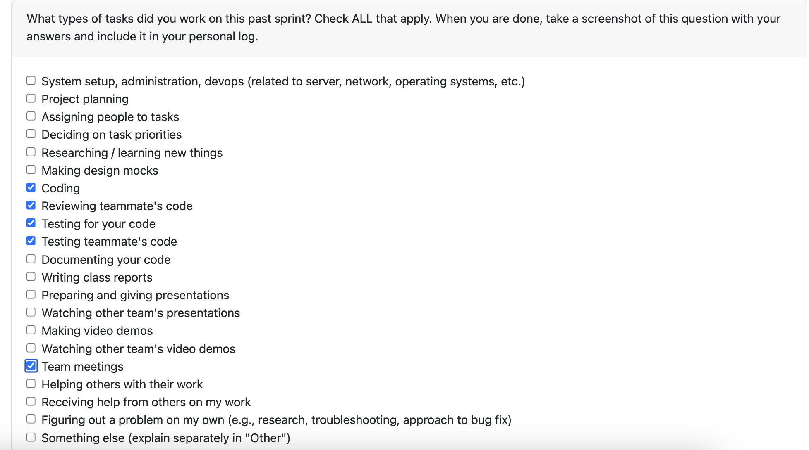

# Individual Log – Abdur Rehman
1. [Week 3](#week-3)
1. [Week 4](#week-4)
1. [Week 5](#week-5)
1. [Week 6](#week-6)
1. [Week 7](#week-7)

## Week 3 

### 1. Type of Tasks Worked On
  

---

### 3. Recap of Weekly Goals
This week focused on foundational project requirement work. I assisted in the following:
- outlining the artifact collection features (directory scanning, file filtering, and metadata)
- drafting the artifact analysis requirements (classification and basic statistics)
- reviewing the dashboard and visualization requirements for summary metrics

---

### 4. Features Owned in Project Plan
- N/A

---

### 5. Tasks from Project Board Associated with These Features
- N/A

---

### 6. Tasks Completed / In Progress in the Last 2 Weeks
| Task ID | Issue Title | Status       | Notes |
|--------|-------------|-------------|-------|
| N/A    | N/A         | N/A         | N/A   |

---

### 7. Additional Context
N/A

---

## Week 4
This section outlines the individual log for week 4

### September 22 - September 28

### Tasks

### Weekly Goals

1. My Features: 
    - Connected project requirements to the architecture layout.
    - Polished and expanded the requirements section for the proposal.

2. Associated Tasks
    - Refining and writing project proposal.

3. Completed/In-Progress
    - Finalized the requirements and proposal write-up.

## Week 5
This section outlines the individual log for week 5

### September 29 - October 5

### Tasks

### Weekly Goals

1.Weekly Goals

My Focus Areas:

Develop Level 0 and Level 1 Data Flow Diagrams (DFDs)

2.Related Tasks:

Work on creating and refining the Data Flow Diagram

3.Progress Summary:

Finished the Level 0 DFD

Completed the Level 1 DFD
---

## Week 6
This section outlines the individual log for week 6

### October 6 - October 12

### Tasks

### Weekly Goals

1. My Features: 
    - Create and revise WBS chart based on project updates

2. Associated Tasks
    - Work Breakdown Structure

3. Completed/In-Progress
    - Completed initial WBS chart
    - Revised WBS chart according to updated project requirements

## Week 7 – October 13 to October 19

### 1. Type of Tasks Worked On

---

### 3. Recap of Weekly Goals
This week focused on developing and testing the consent management functionality for the system.
My main contributions included:

-implementing the User Directory Consent Manager module to handle user consent for directory data access

- writing and running unit tests to verify consent operations such as grant, revoke, and reset

- designing the system to be compatible with future modules like LLM access consent and external data analysis
---

### 4. Features Owned in Project Plan
- User Consent – Directory Access  
- Consent Management Module  

---

### 5. Tasks from Project Board Associated with These Features
- User Consent – Directory Access (#16)  
 

---

### 6. Tasks Completed / In Progress in the Last 2 Weeks
| Task ID | Issue Title                           | Status       | Notes |
|----------|---------------------------------------|--------------|-------|
| 16     | User Consent – Directory Access | Completed  | 
---

### 7. Additional Context
- All tests for the User Directory Consent Manager passed successfully after debugging one write-handling issue.

- Code was structured to integrate easily with future LLM access consent and external analysis features.

- Continued documenting and refining the module for clarity and maintainability.

## Week 8
This section outlines the individual log for week 7

### October 20 - October 26

### Tasks

### Weekly Goals

1. My Features:
    - Implement a comprehensive PNG/JPEG Image Processor capable of extracting detailed metrics from image files
    - Build full unit test coverage and documentation
    - Integrate batch image analysis functionality
    - Improve code performance for color and brightness analysis

2. Associated Tasks
    - Develop ImageProcessor class with all metric extraction methods
    - Implement methods for:
        - Resolution, aspect ratio, file stats, brightness, and color analysis
        - EXIF metadata extraction and edit frequency tracking
    - Create automated tests covering all major and edge cases
    - Write complete API documentation and example usage scripts
    - Update requirements.txt with necessary dependencies (Pillow, NumPy)

3. Completed/In-Progress
    - src/image_processor.py 
        - Implemented ImageProcessor class with all core metric extraction features
        - Added full error handling, logging, and validation
    - tests/test_image_processor.py 
        - Added 24 comprehensive unit tests
        - Verified edge cases and error conditions
        - All tests passing 
    - docs/IMAGE_PROCESSOR.md 
        - Full API documentation
        - Usage examples, return structures, and detailed metric descriptions
    - src/image_processor_example.py 
        - Demonstrates single and batch image analysis
    

### Reflection Points

**What went well:**
- Successfully implemented a fully functional and modular image processor
- Achieved 100% test coverage with well-structured, maintainable tests
- Documentation provides clear guidance for both users and developers
- Batch processing feature optimized for speed and memory efficiency

**What didn't go well:**
- Initial dominant color extraction was slow — required optimization using image resizing
- Documentation took longer than planned due to scope and completeness goals
- Some EXIF data parsing inconsistencies between image formats

### Planning Activities for Next Cycle

**Week 9 Goals:**
- Most likely will take on more of a dev role next week to start implementing features.
- Review and refine issue descriptions based on team feedback
- Begin sprint planning with team for Milestone #1 deliverables
- Focus on core infrastructure components that other features depend on