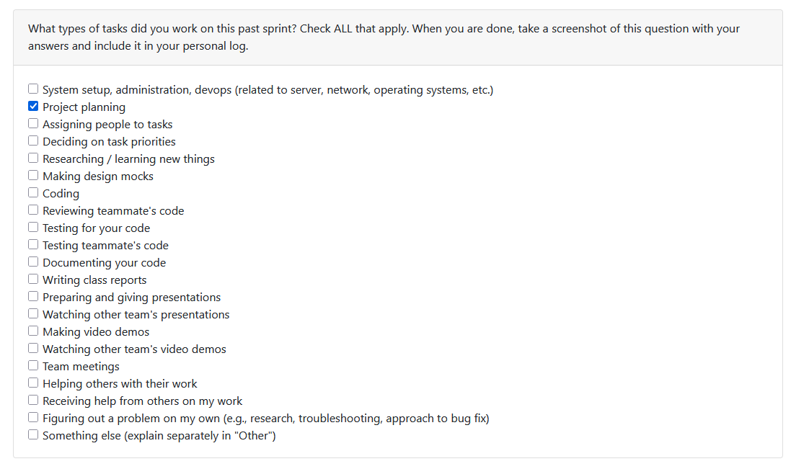
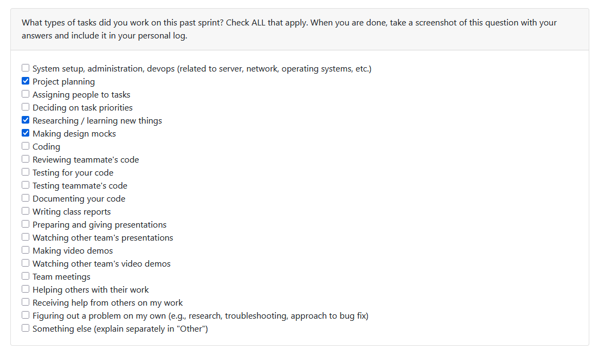

# Individual Log – Abhinav Malik

## Week 3 – September 15 to September 21

### 1. Type of Tasks Worked On
  

---

### 3. Recap of Weekly Goals
This week was mainly focused on early requirement gathering and planning activities. My contributions included:  
- helping define the project requirements and scope  
- reviewing features related to artifact collection and analysis with the team  
- collaborating with group members to finalize the initial requirements document  

---

### 4. Features Owned in Project Plan
- Requirements Documentation  

---

### 5. Tasks from Project Board Associated with These Features
- Project Requirements  

---

### 6. Tasks Completed / In Progress in the Last 2 Weeks
| Task ID | Issue Title          | Status     | Notes |
|---------|----------------------|------------|-------|
| 3       | Project Requirements | Completed  | Drafted and reviewed with team |

---

### 7. Additional Context
N/A

## Week 4 – September 22 to September 28

### 1. Type of Tasks Worked On

---

### 3. Recap of Weekly Goals
This week, the focus shifted to design and proposal activities. My contributions included:  
- collaborating on creating the system architecture diagram  
- contributing to drafting and completing the project proposal  

---

### 4. Features Owned in Project Plan
- System Architecture Diagram  
- Project Proposal  

---

### 5. Tasks from Project Board Associated with These Features
- System Architecture Diagram  
- Project Proposal  

---

### 6. Tasks Completed / In Progress in the Last 2 Weeks
| Task ID | Issue Title              | Status       | Notes |
|---------|--------------------------|--------------|-------|
| 4       | System Architecture      | Completed    | Worked with team to finalize diagram |
| 5       | Project Proposal         | In Progress  | Draft completed, reviewing with team |

---

### 7. Additional Context
N/A  

--- 

## Week 5 – September 29 to October 5

### 1. Type of Tasks Worked On

---

### 3. Recap of Weekly Goals
This week focused on data flow diagrams and system modeling activities. My contributions included:  
- collaborating on creating Level 0 and Level 1 Data Flow Diagrams (DFDs)  
- reviewing and refining the DFDs with the team to ensure logical flow and accuracy  
- discussing with other teams for feedback and improvement  

---

### 4. Features Owned in Project Plan
- Data Flow Diagram  

---

### 5. Tasks from Project Board Associated with These Features
- Data Flow Diagram  

---

### 6. Tasks Completed / In Progress in the Last 2 Weeks
| Task ID | Issue Title          | Status     | Notes |
|---------|----------------------|------------|-------|
| 6       | Data Flow Diagram    | Completed  | Created Level 0 and Level 1 DFDs with team collaboration |

---

### 7. Additional Context
N/A  