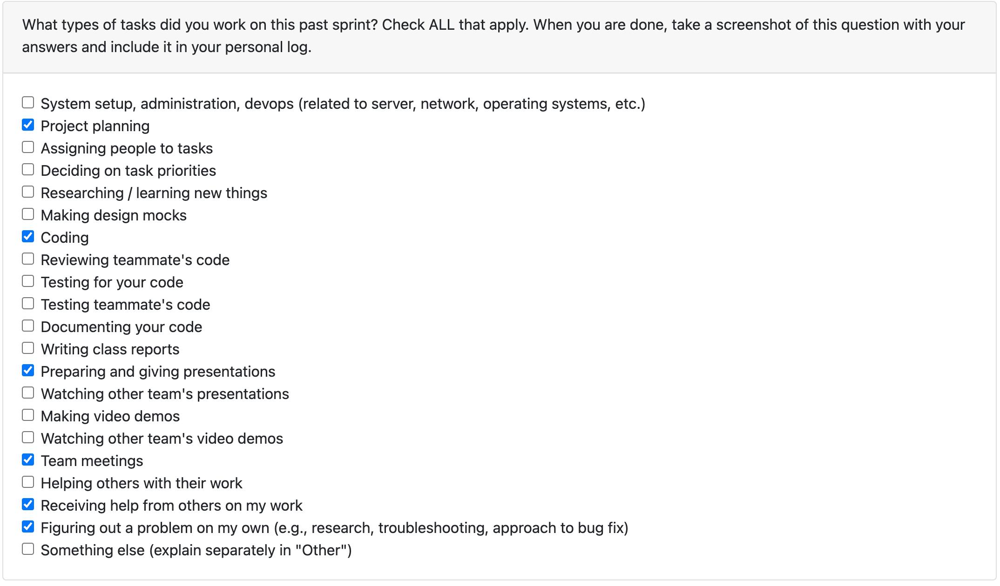

# Individual Log – Misha Gavura

## Week 5
This section outlines the individual log for week 5

### 29th September 2025 - 5th October 2025

### Tasks

### Weekly Goals

#### What I did
- Co-created Level 0 (context) and Level 1 DFDs.
- Met with other teams to compare models and resolve naming, scope, and data-flow differences.
- Incorporated feedback and finalized a team-approved diagram set with brief notes.

#### Project board
- **Task:** Data Flow Diagram (L0 & L1)
- **Deliverables:** Diagrams + short legend/decision log

#### Status
- Completed — diagrams uploaded and linked on the board.

#### Impact / Next
- Shared, clear view of system boundaries and data movement.
- Will version updates as requirements evolve and use these as inputs for the data dictionary and interface specs.

## Week 7
This section outlines the individual log for week 7

### 12th October 2025 - 19th October 2025

### Tasks

### Weekly Goals

#### What I did
Built a production-ready OpenAI integration that analyzes code/commits/projects and generates portfolio content, with comprehensive tests and 5 detailed guides showing exactly how to use and customize it.

#### Project board
- **Task:** 
External LLM Analysis #20: https://github.com/COSC-499-W2025/capstone-project-team-14/issues/20

#### Status
Result: Team can now use AI to analyze artifacts, extract skills, and generate professional portfolio summaries. Just add an API key and it works! 🚀

#### Impact / Next
- Connect the integration with the file separator
- Ensure that conscent screen is present before running the LLM access and sending requests

## Week 9
This section outlines the individual log for week 9

### 27th October 2025 - 2 November 2025

### Tasks

### Weekly Goals

#### What I did
Creates a summary using OpenAI API for the docx, pptx, text files, ready to use.
Planning on expanding it and working for more file types.

#### Project board
- **Task:** 
External LLM Analysis #20: https://github.com/COSC-499-W2025/capstone-project-team-14/issues/20

#### Status
Creates a summary using OpenAI API for the docx, pptx, text files, ready to use.
Planning on expanding it and working for more file types.

#### Impact / Next
- Work on image summary
- Work on code summary

## Week 13
This section outlines the individual log for week 13

### November 23 2025 to November 30  

### Tasks

### Weekly Goals

#### What I did
I'm in a progress of implementation of a chronological timeline generator that analyzes project artifacts by modification date and builds a unified skills timeline. The system processes code files, documents, images, and videos, extracting skills and metadata from each. It sorts all artifacts chronologically, tracking when specific skills first appeared and how they evolved over time. The analyzer integrates outputs from multiple specialized analyzers (code, text, image, video) into a single timeline view. Results export to JSON, CSV, and plain text formats, showing skill progression across the entire project history. This enables portfolio creators to demonstrate skill development and project evolution with concrete timestamps.
Output: Chronological skill timeline with timestamps, categories, and detected skills per artifact.

Worked on a presentation and prepared slide for the Git Code Analysis and History

#### Project board
- **Task:** 
External LLM Analysis #33: https://github.com/orgs/COSC-499-W2025/projects/19/views/2?pane=issue&itemId=133282130&issue=COSC-499-W2025%7Ccapstone-project-team-14%7C33

#### Status
In progress, most part is done, doing some testing

#### Impact / Next
- Generate Chronological Project List Issue #35
