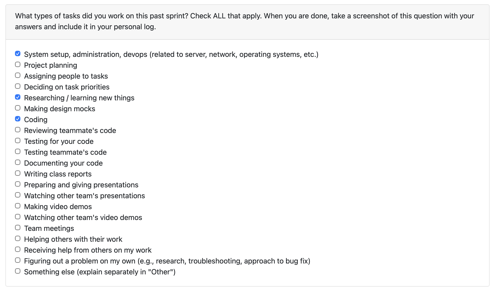
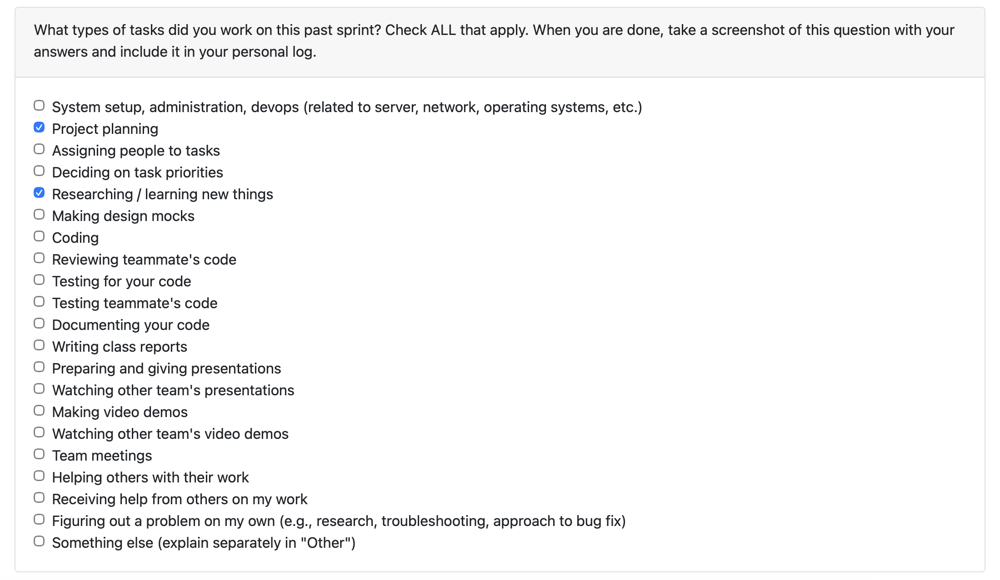

# Individual Log – Abijeet Dhillon

[Week 3 Individual Logs](#week-3) 
[Week 4 Individual Logs](#week-4) 
[Week 5 Individual Logs](#week-5) 
[Week 6 Individual Logs](#week-6) 
[Week 7 Individual Logs](#week-7)

## Week 7

### October 13 2025 to October 19 2025

### 1. Type of Tasks Worked On

---

### 2. Recap of Weekly Goals

This week, I extended the backend parsing functionality by implementing a new file categorization component, which categorizes files and saves a structured output for later downstream use. I also participated in team meetings, reviewed pull requests, and tested teammates' code on active branches.

---

### 3. Features Owned in Project Plan

- Categorize Files & Create Structured Representation (#50)
- Store/Load User Configurations (#22)

---

### 4. Tasks from Project Board Associated with These Features

- Categorize Files & Create Structured Representation (#50)
- Store/Load User Configurations (#22)

---

### 5. Tasks Completed / In Progress in the Last 2 Weeks

| Task ID | Issue Title                                         | Status      | Notes                                                                                                                                                                                                                                                                                           |
| ------- | --------------------------------------------------- | ----------- | ----------------------------------------------------------------------------------------------------------------------------------------------------------------------------------------------------------------------------------------------------------------------------------------------- |
| 50      | Categorize Files & Create Structured Representation | Completed   | Implemented file_categorizer.py to walk through project folders, classify files by type (code, docs, images, sketches, other), and store the output in a structured JSON format for downstream processing. Also added pytest coverage to validate edge cases and language-based categorization. |
| 15      | Store/Load User Configurations                      | In Progress | N/A                                                                                                                                                                                                                                                                                             |

---

### 6. Future Cycle Plans

In the upcoming cycle, I plan to: - Integrate the file categorization output into the larger data workflow (once it is established). - Implement a user configuration storage method to allow persistent environment settings for users. - Collaborate with teammates to potentially connect the parsing component and categorizer component to create a unified backend pipeline.

---

## Week 6

### October 6 to October 12

### 1. Type of Tasks Worked On

---

### 2. Recap of Weekly Goals

This week, I focused on setting up the project environment using docker and ensuring that others can replicate the project environment on their local machines.

---

### 3. Features Owned in Project Plan

- Project Environment Setup

---

### 4. Tasks from Project Board Associated with These Features

- Project Environment Setup

---

### 5. Tasks Completed / In Progress in the Last 2 Weeks

| Task ID | Issue Title               | Status    | Notes |
| ------- | ------------------------- | --------- | ----- |
| 15      | Project Environment Setup | Completed | N/A   |

---

### 6. Additional Context

N/A

---

## Week 5

### September 29 to October 5

### 1. Type of Tasks Worked On

---

### 2. Recap of Weekly Goals

This week focused on a collaborative effort of our team members to understand and create an initial data flow diagram for level 0 and level 1. I assisted in the following:

- creating the project's level 0 data flow diagram
- creating the project's level 1 data flow diagram
- collaborating with other teams to discuss differences in ideas of data flow diagrams

---

### 3. Features Owned in Project Plan

- Data Flow Diagram

---

### 4. Tasks from Project Board Associated with These Features

- Data Flow Diagram

---

### 5. Tasks Completed / In Progress in the Last 2 Weeks

| Task ID | Issue Title       | Status    | Notes |
| ------- | ----------------- | --------- | ----- |
| #9      | Data Flow Diagram | Completed | N/A   |

---

### 6. Additional Context

N/A

---

## Week 4

### September 22 to September 28

### 1. Type of Tasks Worked On

---

### 2. Recap of Weekly Goals

This week focused on understanding the project scope, creating the proposal and drawing the system architecture design diagram. I collaborated with my team members in the following:

- creating the project proposal
- creating the system architecture design diagram

Future weeks will include more detailed documentation of tasks as work progresses.

---

### 3. Features Owned in Project Plan

- System Architecture Diagram
- Project Proposal

---

### 4. Tasks from Project Board Associated with These Features

- System Architecture Diagram
- Project Proposal

---

### 5. Tasks Completed / In Progress in the Last 2 Weeks

| Task ID | Issue Title                 | Status    | Notes |
| ------- | --------------------------- | --------- | ----- |
| #5      | System Architecture Diagram | Completed | N/A   |
| #6      | Project Proposal            | Completed | N/A   |

---

### 6. Additional Context

N/A

---

## Week 3

### September 15 to September 21

### 1. Type of Tasks Worked On

---

### 2. Recap of Weekly Goals

This week focused on foundational project setup work. I assisted in the following:

- creating the project requirements document
- initializing the repository
- setting up the Kanban project board on GitHub

Future weeks will include more detailed documentation of tasks as work progresses.

---

### 3. Features Owned in Project Plan

- Project Requirements

---

### 4. Tasks from Project Board Associated with These Features

- Project Requirements

---

### 5. Tasks Completed / In Progress in the Last 2 Weeks

| Task ID | Issue Title          | Status    | Notes |
| ------- | -------------------- | --------- | ----- |
| 3       | Project Requirements | Completed | N/A   |

---

### 6. Additional Context

N/A

---
