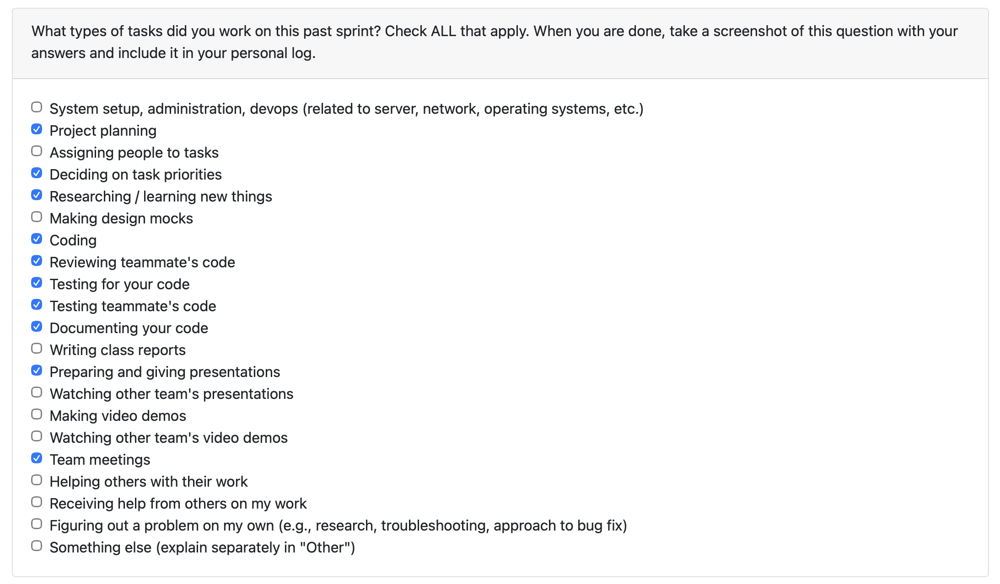
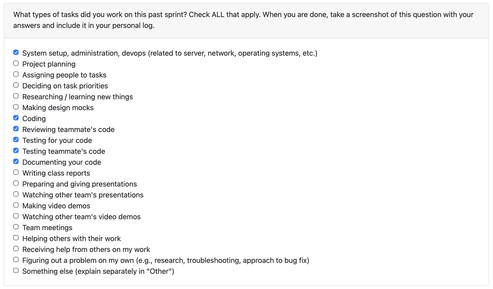

# Individual Log – Abijeet Dhillon

[Week 3 Individual Logs](#week-3) 
[Week 4 Individual Logs](#week-4) 
[Week 5 Individual Logs](#week-5) 
[Week 6 Individual Logs](#week-6) 
[Week 7 Individual Logs](#week-7) 
[Week 8 Individual Logs](#week-8) 
[Week 9 Individual Logs](#week-9) 
[Week 10 Individual Logs](#week-10) 
[Week 12 Individual Logs](#week-12) 
[Week 13 Individual Logs](#week-13) 
[Week 14 Individual Logs](#week-14)

---

## Week 14

### December 1 2025 to December 7 2025

### 1. Type of Tasks Worked On

---

### 2. Recap of Weekly Goals

This week I focused on closing PR #169 to finish the remaining Milestone 1 requirements across storage/retrieval and consent. On the storage side, I brought the ProjectInsightsStore and orchestrator back in sync by updating the run metadata we persist, refreshing the retrieval CLI to replay stored runs cleanly, and tightening the backup/restore helpers so we can safely move snapshots between environments. I also verified the end-to-end flow in Docker to make sure the pipeline writes into the refreshed schema and that retrieval still works even after reorganizing the data layout. On the consent side, I extended the UserConfigManager to capture a separate “data consent” flag alongside LLM consent, wired both prompts through the pipeline CLI so users can set them once and skip future prompts, and made sure they are persisted and retrievable via the config manager CLI. I updated the docs around configuration and storage so the new consent flag and retrieval steps are clear, and synced with the team to confirm this satisfies Milestone 1 before we pivot to the next set of deliverables.

---

### 3. Features Owned in Project Plan

- Bring Storage & Retrieval Up To Date (#165)
- Add Data Consent To User Configurations (#168)

---

### 4. Tasks from Project Board Associated with These Features

- Bring Storage & Retrieval Up To Date (#165)
- Add Data Consent To User Configurations (#168)

---

### 5. Tasks Completed / In Progress in the Last 2 Weeks

| Task ID | Issue Title                            | Status    | Notes                                                                                                                                                                                                                               |
| ------- | -------------------------------------- | --------- | ----------------------------------------------------------------------------------------------------------------------------------------------------------------------------------------------------------------------------------- |
| 165     | Bring Storage & Retrieval Up To Date   | Completed | In PR #169 I refreshed the ProjectInsightsStore/orchestrator path to align with the latest schema, ensured runs persist correctly, tightened backup/restore helpers, and verified the retrieval CLI can replay stored runs end to end. |
| 168     | Add Data Consent To User Configurations | Completed | PR #169 also added a persisted “data consent” flag to UserConfigManager, wired it (with LLM consent) into the pipeline CLI prompts, and documented the config manager/CLI paths so users can set or update both consents once.       |

---

### 6. Future Cycle Plans & Reflection On This Week

This week felt good—I wrapped up PR #169 to land the storage/retrieval refresh and data consent work, which means our team has completed all of the Milestone 1 requirements without scrambling at the last minute. The flow feels stable, testing went smoothly, and it was nice to finish the sprint on schedule while already looking forward to a short winter break.

For the next cycle, I plan to shift focus to Milestone 2 by building on the updated storage/retrieval paths so we can showcase richer portfolio/resume artifacts and tightening any consent/documentation gaps that show up during demos. With Milestone 1 behind us, the priority is to keep momentum while pacing myself for the holidays and making sure the next milestone is just as smooth.

---

## Week 13

### November 24 2025 to November 30 2025

### 1. Type of Tasks Worked On

---

### 2. Recap of Weekly Goals

This week, I focused on integrating LLM consent cleanly into the artifact pipeline’s CLI and making sure it’s wired through our existing SQLite-backed user configuration system in a way that feels “one and done” for the user. I updated the orchestrator so it now shows a single y/n consent prompt with a short privacy notice, persists that choice via UserConfigManager (defaulting to --user-id root but supporting per-user IDs), and then branches behavior so that runs with consent enabled execute the LLM summarization step on top of the local analyzers, while opt-out runs stick to local analysis only. I documented this flow end-to-end in docs/config_management.md, including concrete docker-compose commands for running the pipeline with different --user-id values, flipping --llm-consent yes|no via the config manager CLI, and re-running the pipeline to confirm that prompts are skipped once consent is stored. On the testing side, I expanded the pytest suite (e.g., test_llm_consent_flow.py and test_orchestrator_coverage.py) and ran it inside Docker to bring coverage up over the orchestrator and config manager, validating both the CLI behavior and the consent-driven code paths. As a team, we also held a group meeting to walk through the updated pipeline, synced on how we want our presentation slides to clearly explain the pipeline architecture and privacy model, and double-checked the milestone 1 requirements to ensure that our implementation, tests, and documentation are all on track for the upcoming deadline.

---

### 3. Features Owned in Project Plan

- Store Project Insights (#30)
- Connect User Configuration to Pipeline (#148)

---

### 4. Tasks from Project Board Associated with These Features

- Store Project Insights (#30)
- Connect User Configuration to Pipeline (#148)

---

### 5. Tasks Completed / In Progress in the Last 2 Weeks

| Task ID | Issue Title                            | Status    | Notes                                                                                                                                                                                                                               |
| ------- | -------------------------------------- | --------- | ----------------------------------------------------------------------------------------------------------------------------------------------------------------------------------------------------------------------------------- |
| 30      | Store Project Insights                 | Completed | Implemented an **encrypted SQLite-backed ProjectInsightsStore** and wired the pipeline orchestrator to persist each run into `zipfile` and `project` tables in `data/app.db`, including a retrieval CLI and backup/restore helpers. |
| 148     | Connect User Configuration to Pipeline | Completed | Integrated the existing user configuration system into the pipeline's CLI so that the pipeline asks for LLM consent using a simple y/n prompt. The consent is updatable and retrievable as well from our SQLite database.           |

---

### 6. Future Cycle Plans & Reflection On This Week

This week was pretty stressful since all of my courses are starting to wrap up for the end of the semester, and it really felt like time was running out faster than usual. Even with that pressure, I was able to manage my time effectively and get my COSC 499 work done: I integrated LLM consent cleanly into the artifact pipeline’s CLI, wired it through the existing SQLite-backed UserConfigManager, and made sure the orchestrator only prompts once with a clear privacy notice before branching between LLM + local analyzers or local-only runs. I also documented the end-to-end flow in docs/config_management.md, added the necessary Docker/CLI examples for toggling consent, and expanded the pytest coverage around the consent and orchestrator paths, all while syncing with my teammates in our group meeting to review the updated UX and milestone requirements.

For the next cycle, I plan to shift focus toward storing and retrieving the generated portfolio and résumé items, building on the functionality that Tahsin implemented this sprint so that we can plug those outputs cleanly into our database-backed flow. The goal is to close the loop from analyzed projects to reusable, queryable presentation artifacts in time for Milestone 1. Overall, despite the busy week, things went well. I feel confident about our upcoming video demo and presentation, and as a team we’re on track to meet all of the Milestone 1 requirements by the due date.

---

## Week 12

### November 10 2025 to November 23 2025

### 1. Type of Tasks Worked On

---

### 2. Recap of Weekly Goals

This week (and last week since it was reading week/week 11), I focused primarily on database integration, backend improvements, and ensuring strong test coverage across updated components. I continued integrating user configuration persistence into the SQLite database, wiring the config manager so configs can be saved, loaded, and updated through the backend, and verifying behavior with manual SQL checks and schema-focused tests. In parallel, I implemented an encrypted SQLite-backed insights store on top of the artifact pipeline so each orchestrator run now automatically writes its ZIP-level and per-project summaries into the new zipfile and project tables in data/app.db via ProjectInsightsStore. I validated this end-to-end flow by running the pipeline in Docker with INSIGHTS_ENCRYPTION_KEY/DATABASE_URL set, inspecting the written rows with sqlite3, using the example retrieval CLI to replay stored runs without re-running analysis, and exercising the backup/restore helpers to confirm we can safely move DB snapshots between environments. I also updated the database schema and insights docs to explain how to persist, retrieve, and back up results, and reviewed my teammates' PRs (3 of them) and participated in team meetings to plan the next stage of pipeline integration. Overall, my work this week pushed our backend closer to a unified, encrypted, and persistent configuration and insights layer ready for pipeline integration.

---

### 3. Features Owned in Project Plan

- Store Project Insights (#30)
- Integrate User Configs Into SQLite Database (#127)

---

### 4. Tasks from Project Board Associated with These Features

- Store Project Insights (#30)
- Integrate User Configs Into SQLite Database (#127)

---

### 5. Tasks Completed / In Progress in the Last 2 Weeks

| Task ID | Issue Title                                 | Status    | Notes                                                                                                                                                                                                                               |
| ------- | ------------------------------------------- | --------- | ----------------------------------------------------------------------------------------------------------------------------------------------------------------------------------------------------------------------------------- |
| 30      | Store Project Insights                      | Completed | Implemented an **encrypted SQLite-backed ProjectInsightsStore** and wired the pipeline orchestrator to persist each run into `zipfile` and `project` tables in `data/app.db`, including a retrieval CLI and backup/restore helpers. |
| 127     | Integrate User Configs Into SQLite Database | Completed | Integrated full user configuration persistence into SQLite via the config manager, enabling save/load/update operations from the backend/CLI and adding tests to validate schema, migrations, and config loading flows.             |

---

### 6. Future Cycle Plans & Reflection On This Week

Next week, I plan to work closely with my teammates to wrap up all of our components and ensure the system is ready for Milestone 1. This will include tightening the integration points between the pipeline orchestrator, the encrypted insights store, and the user config layer, and doing end-to-end runs to verify everything behaves correctly under Docker. Depending on how similar the data shapes are, I may also start wiring the LLM’s analysis output into the existing “store project insights” path so that both local analyzers and LLM-generated insights are persisted in a consistent way.

This week was good overall—I was able to finish the user config integration work and land the core of the insights storage flow while keeping tests and documentation up to date. Getting these foundational pieces in place makes me feel confident about our architecture, and I’m excited to push through Milestone 1 with a system that already feels robust and extensible.

---

## Week 10

### November 3 2025 to November 9 2025

### 1. Type of Tasks Worked On

---

### 2. Recap of Weekly Goals

This week, I focused on improving backend functionality, testing, and persistence. I updated the parser to include absolute file paths and refined the categorizer to output categorized folder information. I refactored the corresponding unit tests for both components to align with the updated outputs while maintaining high test coverage. I also fixed the Dockerfile so the backend image builds and runs without errors. Additionally, I implemented a persistent SQLite database mounted as a Docker volume, enabling reliable storage and retrieval of user configuration data. To verify this setup, I created tests for the database environment and user configuration handling, ensuring proper integration and functionality. I also participated in weekly team meetings to discuss progress, troubleshoot issues, and plan next steps collaboratively while also reviewing my teammate's PRs.

---

### 3. Features Owned in Project Plan

- Update Parser To Have Absolute Path (#106)
- Setting Up SQL DB (#107)

---

### 4. Tasks from Project Board Associated with These Features

- Update Parser To Have Absolute Path (#106)
- Setting Up SQL DB (#107)

---

### 5. Tasks Completed / In Progress in the Last 2 Weeks

| Task ID | Issue Title                         | Status    | Notes                                                                                                                                                                                                                                                                                                                                     |
| ------- | ----------------------------------- | --------- | ----------------------------------------------------------------------------------------------------------------------------------------------------------------------------------------------------------------------------------------------------------------------------------------------------------------------------------------- |
| 36      | Generate Chronological Skill List   | Completed | Implemented cross-analyzer aggregation, chronological ordering by file mtime, optional date filtering, and export to JSON/CSV/TXT in src/analyze/output/. Added unit tests for ordering, serialization, and format parity; participated in review cycles for related analyzer updates and ensured consistent field naming across outputs. |
| 106     | Update Parser To Have Absolute Path | Completed | Updated parser and categorizer components to output an absolute path in addition to the information it already outputted, while also flattening the categorization output. I also used this PR to update the Dockerfile to fix issues when building the Docker image.                                                                     |
| 107     | Setting Up SQL DB                   | Completed | Implemented a persistent SQLite database into the backend service and mounted it as a Docker volume.                                                                                                                                                                                                                                      |

---

### 6. Future Cycle Plans & Reflection On This Week

In the upcoming cycle, I plan to extend the database functionality to fully support user configurations, including saving, loading, and updating configuration data through the backend. I also plan to integrate this functionality with the existing configuration management system, add corresponding unit tests, and ensure the database interactions are properly validated and persistent across container restarts.

From an individual standpoint, this week was very productive. My time management could've been better, but I had 2 midterms on Thursday, which caused me to work on this project later in the week. Given this, I still completed the issues/work I assigned for myself, with no issues.

---

## Week 9

### October 27 2025 to November 2 2025

### 1. Type of Tasks Worked On

> Not available since peer evaluation for week 9 was closed early.

---

### 2. Recap of Weekly Goals

This week, I implemented the chronological skills list generator that aggregates outputs from code, text, image, and video analyzers. It normalizes fields, orders detections by file modification timestamp, supports optional date filtering, and exports JSON/CSV/TXT to src/analyze/output/.

I also wrote unit tests for ordering, filtering, and cross-format parity (including serialization edge cases). Additionally, I participated in team planning meetings and reviewed teammates’ PRs—code and tests—to ensure consistency and smooth integration.

---

### 3. Features Owned in Project Plan

- Generate Chronological Skill List (#36)

---

### 4. Tasks from Project Board Associated with These Features

- Generate Chronological Skill List (#36)

---

### 5. Tasks Completed / In Progress in the Last 2 Weeks

| Task ID | Issue Title                              | Status    | Notes                                                                                                                                                                                                                                                                                                                                     |
| ------- | ---------------------------------------- | --------- | ----------------------------------------------------------------------------------------------------------------------------------------------------------------------------------------------------------------------------------------------------------------------------------------------------------------------------------------- |
| #75     | Connect Zip Folder Parser to Categorizer | Completed | Implemented unified `categorize_parse_zip()` function in `ingest/zip_parser.py` that chains folder parsing and file categorization. Added structured JSON output and ensured correct handling of nested directories. Included unit tests for validation and coverage tracking.                                                            |
| #22     | Store/Load User Configurations           | Completed | Created `config_manager.py` under `src/config/` to handle saving and loading of user configuration JSON files. Integrated LLM and directory consent settings.                                                                                                                                                                             |
| #36     | Generate Chronological Skill List        | Completed | Implemented cross-analyzer aggregation, chronological ordering by file mtime, optional date filtering, and export to JSON/CSV/TXT in src/analyze/output/. Added unit tests for ordering, serialization, and format parity; participated in review cycles for related analyzer updates and ensured consistent field naming across outputs. |

---

### 6. Future Cycle Plans & Reflection On This Week

In the upcoming cycle, I plan to extend the chronological skills list generator to incorporate new fields and signals from teammates’ analyzer updates, and to research (and potentially implement) a more concrete storage method for user configurations.

Upon reflecting on this week, this week went smooth. Everything is working as intended so far and starting my work on Monday noticeably improved time and stress management.

---

## Week 8

### October 20 2025 to October 26 2025

### 1. Type of Tasks Worked On

---

### 2. Recap of Weekly Goals

This week, I focused on integrating the zip parser and file categorizer components into a unified workflow using the categorize_parse_zip() function. This integration enables uploaded zip files to be automatically parsed, validated, and categorized into structured JSON output for consistent downstream processing.

I also implemented a user configuration management system that saves and loads user preferences — including directory paths and consent settings — in a local JSON format in data/configs/. This ensures persistence across sessions and integrates with the existing consent logic in src/consent/.

Additionally, I developed unit tests and coverage tests for both modules to verify correct behavior under different conditions (e.g., missing files, invalid input, nested folder structures), ensuring robustness and measurable test coverage across the new code.

---

### 3. Features Owned in Project Plan

- Store/Load User Configurations (#22)
- Connect Zip Folder Parser to Categorizer (#75)

---

### 4. Tasks from Project Board Associated with These Features

- Store/Load User Configurations (#22)
- Connect Zip Folder Parser to Categorizer (#75)

---

### 5. Tasks Completed / In Progress in the Last 2 Weeks

| Task ID | Issue Title                              | Status      | Notes                                                                                                                                                                                                                                                                          |
| ------- | ---------------------------------------- | ----------- | ------------------------------------------------------------------------------------------------------------------------------------------------------------------------------------------------------------------------------------------------------------------------------ |
| #75     | Connect Zip Folder Parser to Categorizer | Completed   | Implemented unified `categorize_parse_zip()` function in `ingest/zip_parser.py` that chains folder parsing and file categorization. Added structured JSON output and ensured correct handling of nested directories. Included unit tests for validation and coverage tracking. |
| #22     | Store/Load User Configurations           | Completed   | Created `config_manager.py` under `src/config/` to handle saving and loading of user configuration JSON files. Integrated LLM and directory consent settings.                                                                                                                  |
| #36     | Generate Chronological Skill List        | In Progress | Will implement logic to extract and chronologically order skills based on project data. Includes skill categorization by type, proficiency indicators, and multi-format output support (JSON, CSV, text). Also plans to include time-based filtering and confidence scoring.   |

---

### 6. Future Cycle Plans & Reflection On This Week

In the upcoming cycle, I plan to work on the "Generate Chronological Skill List" (issue #36), which will allow users to view a timeline of skills they've developed through their project work. This feature will expand the system's analtical capabilities by connecting project artifacts to skill progression over time, enhancing interpretability of project data.

Upon reflecting on this week, this cycle went smoothly in terms of feature integration and testing coverage. The connection between the parser and categorizer worked as intended, and I successfully established a pattern for storing persistent user configuration data. One area for improvement is better time management on my end, which I improve in week 9 by starting my weekly work on Monday.

---

## Week 7

### October 13 2025 to October 19 2025

### 1. Type of Tasks Worked On

---

### 2. Recap of Weekly Goals

This week, I extended the backend parsing functionality by implementing a new file categorization component, which categorizes files and saves a structured output for later downstream use. I also participated in team meetings, reviewed pull requests, tested teammates' code on active branches, and wrote test cases for my implementations using TDD principles.

---

### 3. Features Owned in Project Plan

- Categorize Files & Create Structured Representation (#50)
- Store/Load User Configurations (#22)

---

### 4. Tasks from Project Board Associated with These Features

- Categorize Files & Create Structured Representation (#50)
- Store/Load User Configurations (#22)

---

### 5. Tasks Completed / In Progress in the Last 2 Weeks

| Task ID | Issue Title                                         | Status      | Notes                                                                                                                                                                          |
| ------- | --------------------------------------------------- | ----------- | ------------------------------------------------------------------------------------------------------------------------------------------------------------------------------ |
| 50      | Categorize Files & Create Structured Representation | Completed   | Implemented file_categorizer.py to walk through project folders, classify files by type, and store the output in a structured JSON format. Also tested tests cases via pytest. |
| 22      | Store/Load User Configurations                      | In Progress | N/A                                                                                                                                                                            |
| 15      | Project Environment Setup                           | Completed   | N/A                                                                                                                                                                            |

---

### 6. Future Cycle Plans

In the upcoming cycle, I plan to:

- Integrate the file categorization output into the larger data workflow (once it is established).
- Implement a user configuration storage method to allow persistent environment settings for users.
- Collaborate with teammates to potentially connect the parsing component and categorizer component to create a unified backend pipeline.

---

## Week 6

### October 6 to October 12

### 1. Type of Tasks Worked On

---

### 2. Recap of Weekly Goals

This week, I focused on setting up the project environment using docker and ensuring that others can replicate the project environment on their local machines.

---

### 3. Features Owned in Project Plan

- Project Environment Setup

---

### 4. Tasks from Project Board Associated with These Features

- Project Environment Setup

---

### 5. Tasks Completed / In Progress in the Last 2 Weeks

| Task ID | Issue Title               | Status    | Notes |
| ------- | ------------------------- | --------- | ----- |
| 15      | Project Environment Setup | Completed | N/A   |

---

### 6. Additional Context

N/A

---

## Week 5

### September 29 to October 5

### 1. Type of Tasks Worked On

---

### 2. Recap of Weekly Goals

This week focused on a collaborative effort of our team members to understand and create an initial data flow diagram for level 0 and level 1. I assisted in the following:

- creating the project's level 0 data flow diagram
- creating the project's level 1 data flow diagram
- collaborating with other teams to discuss differences in ideas of data flow diagrams

---

### 3. Features Owned in Project Plan

- Data Flow Diagram

---

### 4. Tasks from Project Board Associated with These Features

- Data Flow Diagram

---

### 5. Tasks Completed / In Progress in the Last 2 Weeks

| Task ID | Issue Title       | Status    | Notes |
| ------- | ----------------- | --------- | ----- |
| #9      | Data Flow Diagram | Completed | N/A   |

---

### 6. Additional Context

N/A

---

## Week 4

### September 22 to September 28

### 1. Type of Tasks Worked On

---

### 2. Recap of Weekly Goals

This week focused on understanding the project scope, creating the proposal and drawing the system architecture design diagram. I collaborated with my team members in the following:

- creating the project proposal
- creating the system architecture design diagram

Future weeks will include more detailed documentation of tasks as work progresses.

---

### 3. Features Owned in Project Plan

- System Architecture Diagram
- Project Proposal

---

### 4. Tasks from Project Board Associated with These Features

- System Architecture Diagram
- Project Proposal

---

### 5. Tasks Completed / In Progress in the Last 2 Weeks

| Task ID | Issue Title                 | Status    | Notes |
| ------- | --------------------------- | --------- | ----- |
| #5      | System Architecture Diagram | Completed | N/A   |
| #6      | Project Proposal            | Completed | N/A   |

---

### 6. Additional Context

N/A

---

## Week 3

### September 15 to September 21

### 1. Type of Tasks Worked On

---

### 2. Recap of Weekly Goals

This week focused on foundational project setup work. I assisted in the following:

- creating the project requirements document
- initializing the repository
- setting up the Kanban project board on GitHub

Future weeks will include more detailed documentation of tasks as work progresses.

---

### 3. Features Owned in Project Plan

- Project Requirements

---

### 4. Tasks from Project Board Associated with These Features

- Project Requirements

---

### 5. Tasks Completed / In Progress in the Last 2 Weeks

| Task ID | Issue Title          | Status    | Notes |
| ------- | -------------------- | --------- | ----- |
| 3       | Project Requirements | Completed | N/A   |

---

### 6. Additional Context

N/A

---
