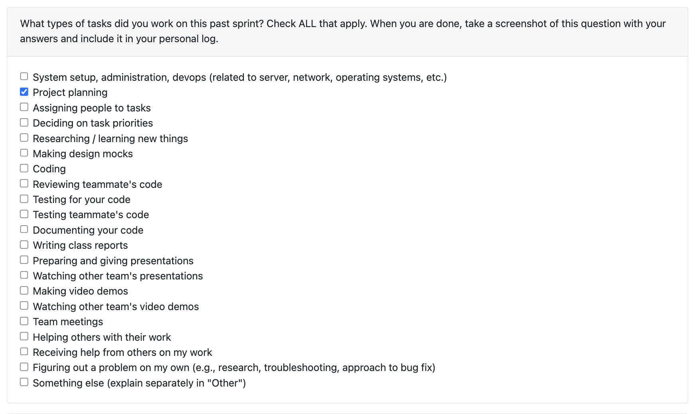
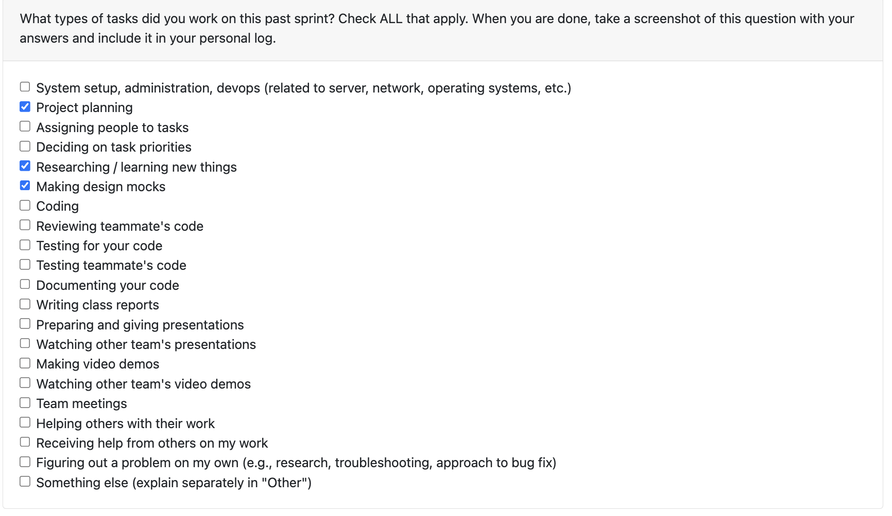
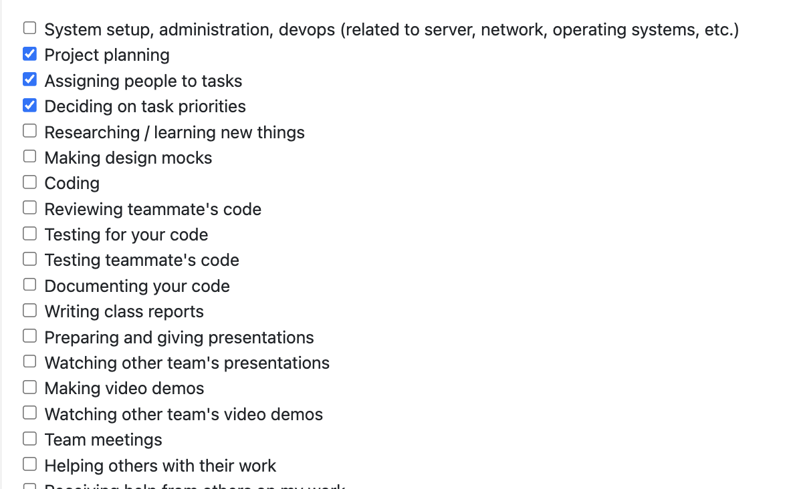
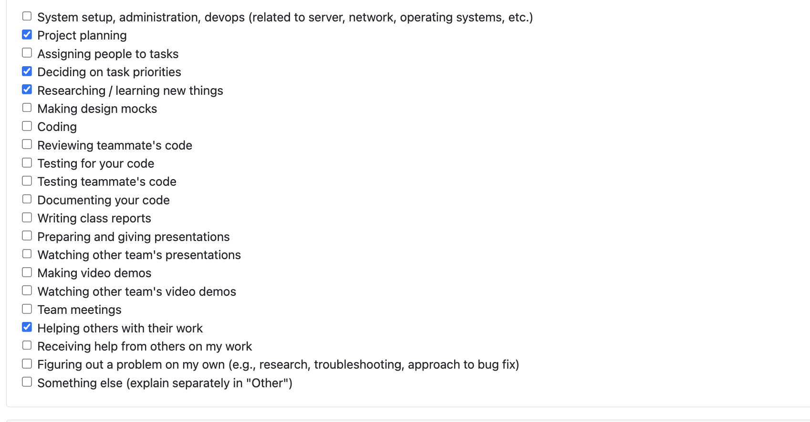
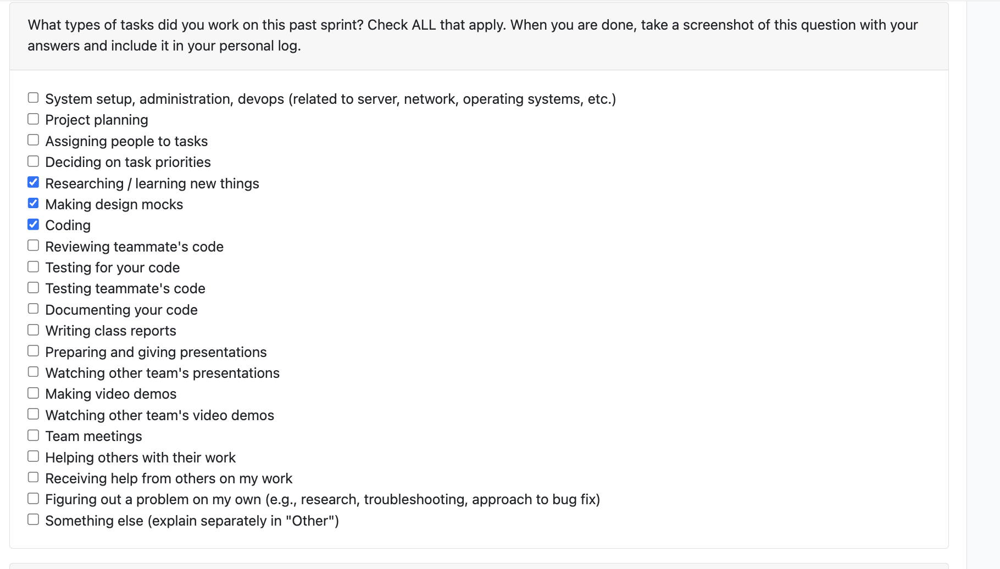
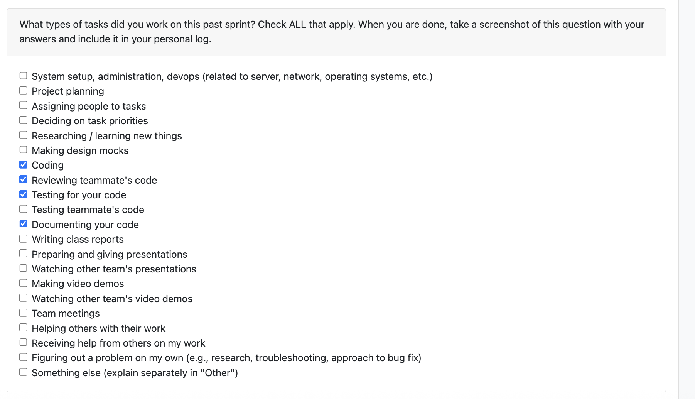

# Individual Log - Kaiden Merchant

## TOC

1. [Week 3](#week-3)
1. [Week 4](#week-4)
1. [Week 5](#week-5)
1. [Week 6](#week-6)
1. [Week 7](#week-7)
1. [Week 8](#week-8)
1. [Week 9](#week-9)
1. [Week 10](#week-10)
1. [Week 12](#week-12)

## Week 3
This section outlines the individual log for week 3

### September 15 - September 21

### Tasks

### Weekly Goals

1. My Features: 
    - Discuss the project outline with the team to understand our user base and project's purpose.
    - Develop / refine our project requirements by discussing with other teams and mapping requirements to use cases.

2. Associated Tasks
    - N/A

3. Completed/In-Progress
    - Completed discussions with the team to understand the project.
    - Completed project requirements document.

## Week 4
This section outlines the individual log for week 4

### September 22 - September 28

### Tasks

### Weekly Goals

1. My Features: 
    - Map requirements to system design components.
    - Build system design architecture diagram.
    - Refine requirements for the project proposal

2. Associated Tasks
    - System Architecture Diagram
    - Project Proposal

3. Completed/In-Progress
    - Completed system architecture diagram with updates from the discussion in class.
    - Completed project proposal.

## Week 5
This section outlines the individual log for week 5

### September 29 - October 5

### Tasks

### Weekly Goals

1. My Features: 
    - Create DFD (level 0, level 1) diagrams

2. Associated Tasks
    - Data Flow Diagram

3. Completed/In-Progress
    - Completed level 0 diagram 
    - Completed level 1 diagram
    
## Week 6
This section outlines the individual log for week 6

### October 6 - October 12

### Tasks

### Weekly Goals

1. My Features: 
    - Revise DFD based on new requirements

2. Associated Tasks
    - Data Flow Diagram

3. Completed/In-Progress
    - Completed refactoring of dfd (via new requirements)

## Week 7
This section outlines the individual log for week 7

### October 13 - October 19

### Tasks

### Weekly Goals

1. My Features: 
    - Update README.md with comprehensive project documentation
    - Take on PM/PO role to build out development backlog
    - Create detailed issue descriptions for all team members

2. Associated Tasks
    - README Documentation Updates
    - Backlog Management and Issue Creation
    - Project Milestone Planning

3. Completed/In-Progress
    - Completed comprehensive README.md updates including:
        - Added Project Milestones section with clear goals for Milestone #1, #2, and #3
        - Added Getting Started section with current capabilities and installation instructions
        - Added API Reference section with core endpoints for Milestone #2
        - Improved project structure and documentation organization
    - Completed backlog creation as PM/PO:
        - Created 18 detailed issue descriptions with user stories, acceptance criteria, and technical requirements
        - Established clear dependencies between issues
        - Assigned story points and priorities for sprint planning
        - Created copy-paste ready issue descriptions for GitHub

### Reflection Points

**What went well:**
- Successfully took on the PM/PO role and created a comprehensive backlog that will guide the team's development efforts
- README updates should help users with getting started info and devs with planning.
- Issue descriptions provide clear direction for all team members, reducing ambiguity
- Established a structured approach to project management that will benefit future sprints

**What didn't go well:**
- Initially struggled with the scope of backlog creation - 18 issues was more extensive than anticipated
- Some issue descriptions required talking with a few members to make sure that the issue was on the right track
- Time management could have been better - spent more time on documentation than originally planned

### Planning Activities for Next Cycle

**Week 8 Goals:**
- Most likely will take on more of a dev role next week to start implementing features.
- Review and refine issue descriptions based on team feedback
- Begin sprint planning with team for Milestone #1 deliverables
- Focus on core infrastructure components that other features depend on

## Week 8
This section outlines the individual log for week 8

### October 20 - October 26

### Tasks

### Weekly Goals

1. My Features: 
    - Implement text analyzer component for document analysis (R5: Media Metadata Extraction)
    - Create comprehensive test suite for text analyzer
    - Build CLI interface and example scripts for component usage

2. Associated Tasks
    - Text Analyzer Implementation
    - Test Suite Development
    - Documentation and Examples

3. Completed/In-Progress
    - Completed text analyzer core implementation:
        - Built `TextAnalyzer` class with support for PDF, DOCX, TXT, and MD files
        - Implemented 15+ metric extractions including word count, sentence count, paragraph count, reading time estimation, lexical diversity, and keyword frequency analysis
        - Added batch processing capability with aggregate statistics across multiple files
        - Created structured `TextMetrics` dataclass for clean dictionary output
    - Completed test suite:
        - Wrote 11 comprehensive tests covering all file types, batch analysis, error handling, and metric validation
        - All tests passing with pytest
        - Tests use temporary files with automatic cleanup
    - Completed supporting tools:
        - Built CLI wrapper (`analyze_text.py`) for command-line usage with pure JSON output
        - Created example script (`example_txt_analysis.py`) that generates sample files and demonstrates usage
        - Added robust import handling to work from any directory
    - Documentation:
        - Created comprehensive README for the text analyzer component
        - Wrote PR template with detailed description of changes
        - Documented usage examples for both CLI and Python API

## Week 9
This section outlines the individual log for week 9

### October 27 - November 2

### Tasks

### Weekly Goals

1. My Features:
    - Fix PDF analysis bug in `TextAnalyzer` (initialize `heading_info` for PDF branch)
    - Research and draft the user-facing analysis report structure (brainstormed `REPORT_TEMPLATE.md`)
    - Plan how to connect standalone components into a pipeline (ingest → categorize → analyze)

2. Associated Tasks
    - Bugfix: PDF analyzer UnboundLocalError
    - Report template brainstorming/documentation
    - Pipeline architecture planning

3. Completed/In-Progress
    - Completed PDF bugfix by initializing `heading_info = None` in the PDF path to prevent `UnboundLocalError`
    - Created a markdown report template outlining sections for code, documents, images, videos, activity, insights, and metrics summary
    - Drafted an integration plan to route categorized files to the correct analyzers and aggregate results for API response

### Reflection Points

**What went well:**
- Identified and fixed the PDF-specific error quickly without impacting TXT/DOCX/MD paths
- The report template provides clarity on what the end-user will see and helps guide development
- Clearer vision for the end-to-end pipeline after planning

**What didn't go well:**
- Some churn around script/module import paths when running analyzer from different directories
- Time split across bugfix and documentation limited time for coding the orchestrator

### Planning Activities for Next Cycle

**Week 10 Goals:**
- Look into how we are going to faciliate the pipeline (maybe implement an orchestrator)
- Define endpoint for API call to trigger the pipeline  
- Optional: introduce a `PipelineConfig` to toggle categories (code/docs/media) and LLM usage

## Week 10
This section outlines the individual log for week 10

### November 3 - November 9

### Tasks

### Weekly Goals

1. My Features:
    - Implement the Pipeline Orchestrator to connect the ZIP parser and file categorizer
    - Create comprehensive test suite for the orchestrator component
    - Set up Docker container for interactive development and testing
    - Document orchestrator usage and prepare for API integration

2. Associated Tasks
    - Build `src/pipeline/orchestrator.py` with `ArtifactPipeline` class
    - Create `tests/pipeline/test_orchestrator.py` with 18+ test cases
    - Update Docker configuration to keep container running for exec access
    - Write documentation for running orchestrator locally and in Docker

3. Completed/In-Progress
    - ✅ Implemented `ArtifactPipeline` orchestrator with `start()` method that accepts ZIP file path
    - ✅ Orchestrator successfully connects parser → categorizer and returns structured output
    - ✅ Created comprehensive test suite covering:
      - Basic functionality (initialization, valid/invalid inputs)
      - ZIP metadata extraction and validation
      - File info extraction (paths, sizes, hashes)
      - File categorization by type (code, docs, images, other)
      - Language detection and grouping for code files
      - Edge cases (empty ZIPs, nested directories)
      - Full integration and JSON serialization
    - ✅ All 18 tests passing
    - ✅ Updated Dockerfile CMD to `tail -f /dev/null` to keep container running
    - ✅ Verified orchestrator works both locally and inside Docker container
    - ✅ Created documentation (`src/pipeline/README.md`) with usage examples

### Reflection Points

**What went well:**
- The orchestrator design is clean and extensible - easy to add analyzer routing in the next phase
- Test suite is comprehensive and caught issues early (e.g., JSON files categorized as code, not other)
- Docker setup now supports interactive development - can exec in and run scripts easily
- Output format is well-structured and JSON-serializable, ready for API responses
- Good separation of concerns: orchestrator delegates to existing parser/categorizer without duplicating logic

**What didn't go well:**
- Initial confusion about Docker container lifecycle (container was exiting immediately)
- Python path issues with pytest imports required adding `sys.path` fix to test file
- Some back-and-forth on test expectations (e.g., where JSON files should be categorized)

**Technical Decisions:**
- Chose to keep orchestrator simple for now - just connects parser + categorizer
- Analyzer routing will be added in next phase to avoid scope creep
- Used `tail -f /dev/null` pattern to keep Docker container alive for interactive use
- Decided to filter macOS metadata files (`__MACOSX`, `.DS_Store`, `._*`) at categorization level

### Planning Activities for Next Cycle

**Week 11 Goals:**
- Connect analyzer components (CodeAnalyzer, TextAnalyzer, ImageProcessor, VideoAnalyzer) to orchestrator
- Implement analyzer routing logic based on file categories
- Aggregate analysis results into unified output structure
- (if time permits) Set up FastAPI endpoints to expose the pipeline via REST API
- (if time permits) Add port mapping to docker-compose and test API calls from host machine

## Week 12
This section outlines the individual log for week 12

### November 17 - November 23

### Tasks

### Weekly Goals

1. My Features: 
    - Refactor pipeline architecture to be "project-centric" (handling multiple projects within a single ZIP)
    - Integrate Git repository detection and analysis into the pipeline
    - Connect all local analyzer components (Text, Code, Image, Video) to the orchestrator
    - Implement handling for miscellaneous/loose files outside project directories

2. Associated Tasks
    - Orchestrator Refactoring & Project Detection Logic
    - Git Analyzer Integration
    - Analyzer Component Connection (4 analyzers)
    - Docker Dependency Management (Tesseract, Git, FFmpeg)
    - Error Handling & Edge Case Testing

3. Completed/In-Progress
    - ✅ Refactored `ArtifactPipeline` to identify top-level directories as individual projects and process them independently
    - ✅ Integrated `individual_contrib_analyzer` to automatically run on detected Git repositories
    - ✅ Connected all 4 local analyzers to pipeline flow:
      - `TextAnalyzer` for documentation (PDF, DOCX, TXT, MD)
      - `CodeAnalyzer` for code files with language/framework detection
      - `ImageProcessor` for image analysis (resolution, content, OCR)
      - `VideoAnalyzer` for video metadata and transcription
    - ✅ Implemented "Miscellaneous Files" section to capture and analyze root-level files
    - ✅ Updated `Dockerfile` to include system dependencies: `git`, `tesseract-ocr`, `tesseract-ocr-eng`, `ffmpeg`
    - ✅ Restructured output format: Project → Git Analysis → File Analysis (by type)
    - ✅ Added graceful error handling for empty Git repositories and missing dependencies
    - ✅ Updated `src/pipeline/README.md` with new architecture documentation

### Reflection Points

**What went well:**
- The project-centric architecture provides much better data organization, especially for multi-project submissions
- Git integration adds significant value by surfacing contributor metrics alongside code analysis
- All analyzer components now work together seamlessly through the orchestrator
- Output structure is consistent and well-organized, making downstream consumption easier
- Docker setup ensures all system dependencies are portable and reproducible

**What didn't go well:**
- Debugging Docker dependency issues took time (e.g., `tesseract` binary missing despite Python package being installed)
- Handling Git edge cases (empty repos, no commits) required multiple iterations to get messaging right
- Initial confusion about how to handle wrapper folders in ZIP extraction vs actual projects

**Technical Decisions:**
- Chose to detect projects at the top-level directory after unwrapping any single wrapper folder
- Git analysis runs automatically if `.git` directory is detected, with graceful fallback if repo is empty
- Loose files get their own "Miscellaneous Files" section rather than being ignored
- Error handling is defensive - one analyzer failure doesn't break the entire pipeline

### Planning Activities for Next Cycle

**Week 13 Goals:**
- Expose the `ArtifactPipeline` via FastAPI endpoints
- Define API request/response schemas to match new orchestrator output format
- Connect pipeline output to database for persistence
- Begin work on frontend integration to display project-centric results
- Prepare for final integration testing and demo

