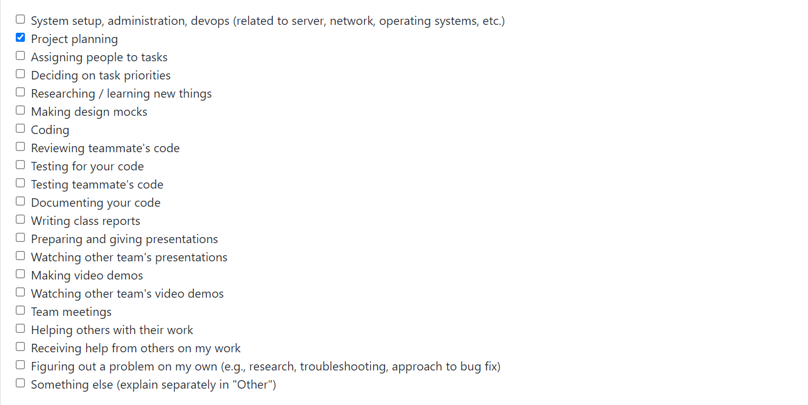
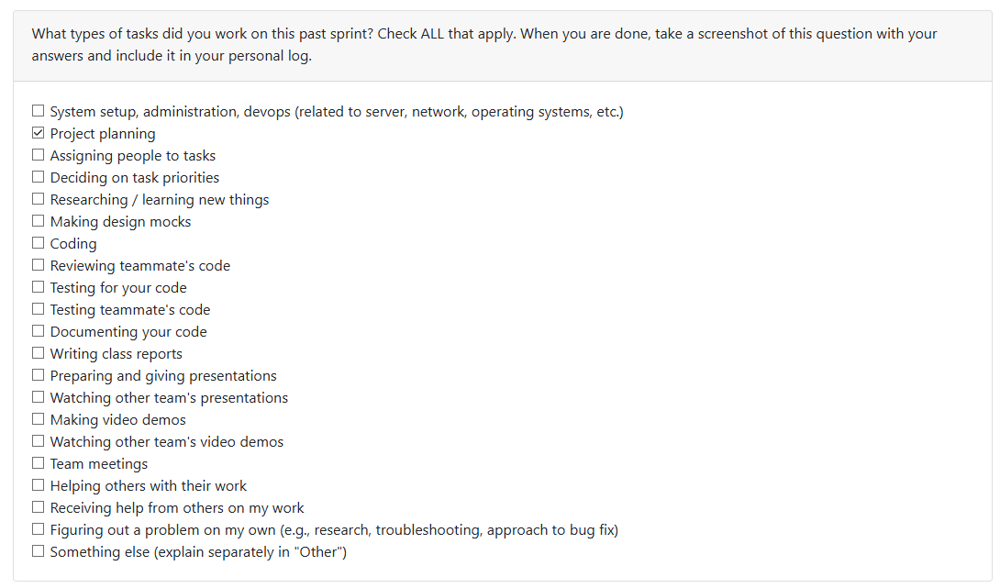
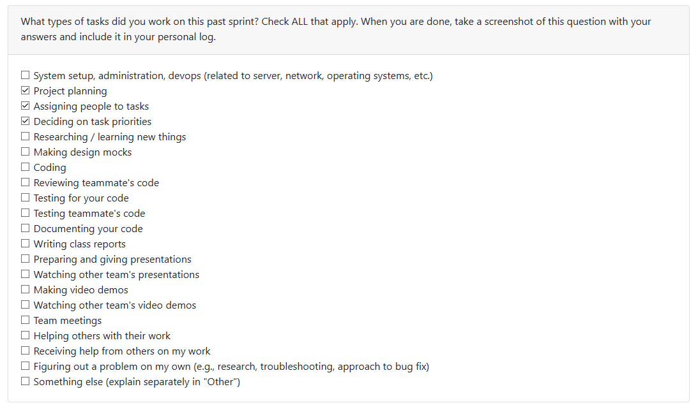

# Personal Log

[Week 3 Personal Logs](#week-3)
[Week 4 Personal Logs](#week-4)
[Week 5 Personal Logs](#week-5)
[Week 6 Personal Logs](#week-6)
[Week 7 Personal Logs](#week-7)
[Week 8 Personal Logs](#week-8)
[Week 9 Personal Logs](#week-9)
[Week 10 Personal Logs](#week-10)
[Week 11 Personal Logs](#week-11)
[Week 12 Personal Logs](#week-12)

## Week 3
### Date Range 
15th September 2025 - 21st September 2025

### Type of tasks worked on

### Weekly Goals
**My features**:
* The goal was to understand the project theme and contribute to the requirements document
* Created requirements document and drafted functional requirements
* Talked with other groups in class to refine our requirements

**Task from project board**:
* "Project Requirements"

**Completed/In-progress tasks**: 
* "Project Requirements"

---
## Week 4
### Date Range 
22nd September 2025 - 28th September 2025

### Type of tasks worked on

### Weekly Goals
**My features**:
* Collaborate on creating the system architecture diagram
* Collaborate on drafting and completing the project proposal

**Task from project board**:
* System Architecture Diagram
* Project Proposal

**Completed/In-progress tasks**: 
* System Architecture Diagram
* Project Proposal

## Week 5
### Date Range 
29th September 2025 - 5th October 2025

### Type of tasks worked on

### Weekly Goals
**My features**:
* Collaborated on creating Level 0 and Level 1 Data Flow Diagrams and discussion with other groups on differences in DFDs

**Task from project board**:
* Data Flow Diagram

**Completed/In-progress tasks**: 
* Data Flow Diagram (Completed)

## Week 6
### Date Range 
6th October 2025 - 12th October 2025

### Type of tasks worked on

### Weekly Goals
**My features**:
* Worked on revising the Data Flow Diagram based on the Milestone #1 requirements
* Setup tasks in the Kanban Board based on Milestone #1 requirements and assigned some people to tasks

**Task from project board**:
* DFD Revision

**Completed/In-progress tasks**: 
* DFD Revision (Completed)

## Week 7
### Date Range 
13th October 2025 - 19th October 2025

### Type of tasks worked on

### Weekly Goals
**My features**:
* Started researching on an parsing a specified zip folder using Python and useful libraries.
* Wrote initial test code to ensure that initially fails but ensures eventually that my feature works as intended.
* Implemented the parser and useful json utility and tested against the written code to ensure it works.

**Task from project board**:
* ZIP Folder Validation and Basic Parser

**Completed/In-progress tasks**: 
* ZIP Folder Validation and Basic Parser (Completed)

**Future cycle plans**:
* The next step will involve storage of the data generated from this sprint (e.g. user configs, folders structure/metadata) and possibly start looking into ways of analyzing this data.

## Week 8
### Date Range 
20th October 2025 - 26th October 2025

### Type of tasks worked on

### Weekly Goals
**My features**:
* Implemented a local code analyzer for the artifact mining system
* The analyzer performs local analysis without external APIs, supporting Python, JavaScript, Java, and C++
* Developed a test-driven approach with 24 unit tests achieving 87% code coverage
* Created working examples to demonstrate the analyzer's capabilities
* Researched on libraries and ways to extend the local code analyzer to be more general (perceval, pydriller, gitpython)

**Task from project board**:
* Local Analysis Pipeline - Code Analyzer

**Completed/In-progress tasks**: 
* Local Analysis Pipeline - Code Analyzer (Completed)

**Future cycle plans**:
- Integrate the code analyzer with git repository scanning using python libraries
- Build aggregation logic for multi-project portfolio statistics
- Storage and evaluation of the extracted contribution metrics for resume items

## Week 9
### Date Range 
27th October 2025 - 2nd November 2025

### Type of tasks worked on

### Weekly Goals
**My features**:
* Generalized and refactored the language and framework detection system into a dedicated module
* Implemented improved parsing using optional libraries (Pygments, tomllib, requirements-parser) with fallbacks
* Extended language support to 17 programming languages
* Created comprehensive test suite for new changes with 71 tests
* Integrated content-based language detection using Pygments as a fallback mechanism
* Implemented robust manifest parsing for pyproject.toml and requirements.txt
* Maintained full backward compatibility with existing code analyzer functionality

**Task from project board**:
* Identify Programming Languages and Framework

**Completed/In-progress tasks**: 
* Identify Programming Languages and Framework (Completed)

**Future cycle plans**:
- Integrate the enhanced code analyzer with git repository scanning (which can help with extracting individual contributions in collaboration projects)
- Build the aggregation layer for multi-repository portfolio analysis

## Week 10
### Date Range 
3rd November 2025 - 9th November 2025

### Type of tasks worked on

### Weekly Goals
**My features**:
* Implemented Git repository analytics with support for both PyDriller and GitPython libraries
* Created project-level analyzer to assess repository scope, collaboration patterns, and development activity
* Developed individual contributor analyzer with fuzzy author matching and detailed per-author metrics
* Built comprehensive test suite with 22 tests achieving 80-90% code coverage across modules
* Implemented activity classification system for commits (feature/bugfix/refactor/docs/test/other)
* Created week-based activity aggregation for trend analysis

**Task from project board**:
* Detect Individual/Collaboration Projects and Git Repository Analysis
* Extrapolate Individual Contributions

**Completed/In-progress tasks**: 
* Detect Individual/Collaboration Projects and Git Repository Analysis (Completed)
* Extrapolate Individual Contributions (Completed)

**Future cycle plans**:
- Wire git analytics into the main analysis pipeline
- Use database persistence for storing repository metrics
- Create visualization layer for contributor graphs and activity trends

## Week 11
### Date Range 
10th November 2025 - 16th November 2025

### Type of tasks worked on
Since there are no peer evaluations, here is a list of tasks worked on:
- Coding
- Testing my own features
- Testing other's features

### Weekly Goals
**My features**:
* Implemented canonical rank-aware ProjectInfo aggregator for merging local and git analyzer metrics
* Created unified data model with standardized fields for source identification, duration tracking, and collaboration detection
* Implemented rank-aware computation system calculating LOC, commits, skills breadth, recency, collaboration flag, and code fraction
* Built preliminary scoring formula using weighted log-scaled metrics for immediate demo capability
* Created comprehensive test suite with 11 tests achieving 75% code coverage 
* Developed CLI interface supporting local/git/merge modes with JSON input/output
* Implemented case-insensitive unions for languages/frameworks/skills with first-occurrence casing preservation
* Added extension-to-language mapping for git metrics normalization

**Task from project board**:
* Extract Key Contribution Metrics

**Completed/In-progress tasks**: 
* Extract Key Contribution Metrics (Completed)

**Future cycle plans**:
- Integrate aggregator with main pipeline to combine local and git analysis results
- Build ranking engine using rank_inputs for project significance scoring
- Implement persistence layer for storing aggregated ProjectInfo objects
- Create API endpoints for retrieving ranked project portfolios

## Week 12
### Date Range 
17th November 2025 - 23rd November 2025

### Type of tasks worked on

### Weekly Goals
**My features**:
* Implemented automatic portfolio and resume item generation for each analyzed project
* Developed PortfolioItem dataclass with structured fields: tagline, description, languages, frameworks, skills, collaboration status, and metrics
* Developed ResumeItem dataclass generating 2-3 professional bullet points tailored to individual vs. collaborative projects
* Integrated presentation generators into main pipeline orchestrator in _process_project() method
* Enhanced console output to display portfolio taglines and resume bullets in pipeline summary
* Created comprehensive test suite with 33 tests (27 unit tests, 5 integration tests, 1 demonstration test) achieving full coverage
* Implemented intelligent tagline generation distinguishing individual vs. collaborative projects with language/framework detection
* Built resume bullet generation with structured format: project scope, version control discipline, and skills application
* Added automatic list truncation (10 languages, 10 frameworks, 15 skills) to prevent overwhelming output

**Task from project board**:
* Generate Portfolio and Resume Data

**Completed/In-progress tasks**: 
* Generate Portfolio and Resume Data (Completed)

**Future cycle plans**:
- Integrate presentation items with database persistence layer for storage and retrieval
- Implement ranking/filtering system to highlight most significant projects in portfolio summaries