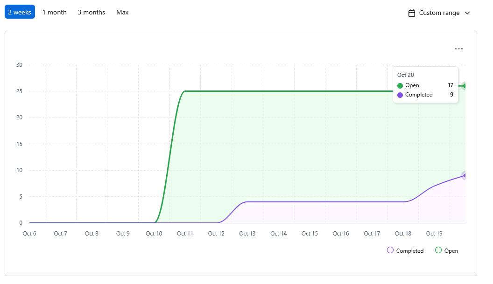
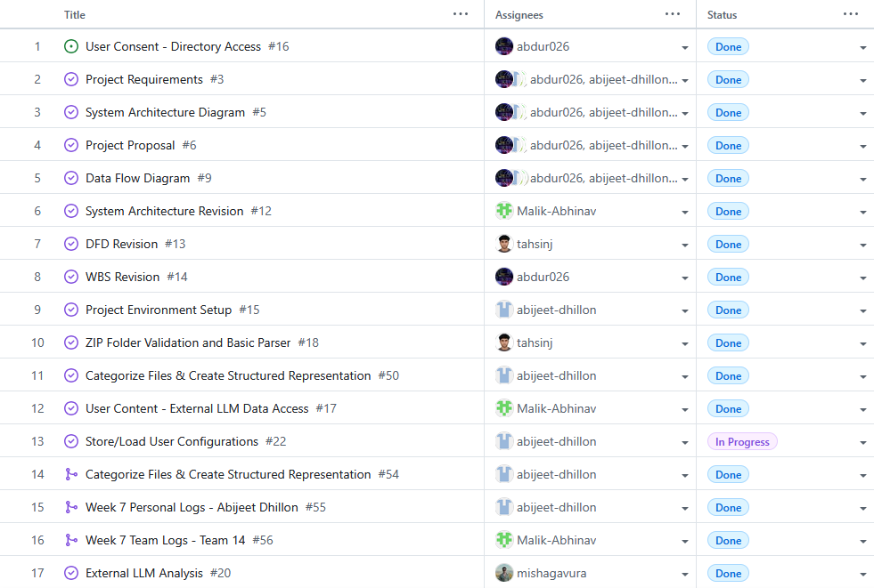
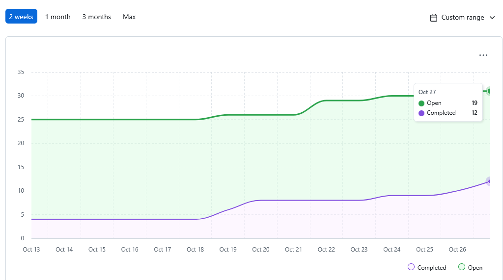
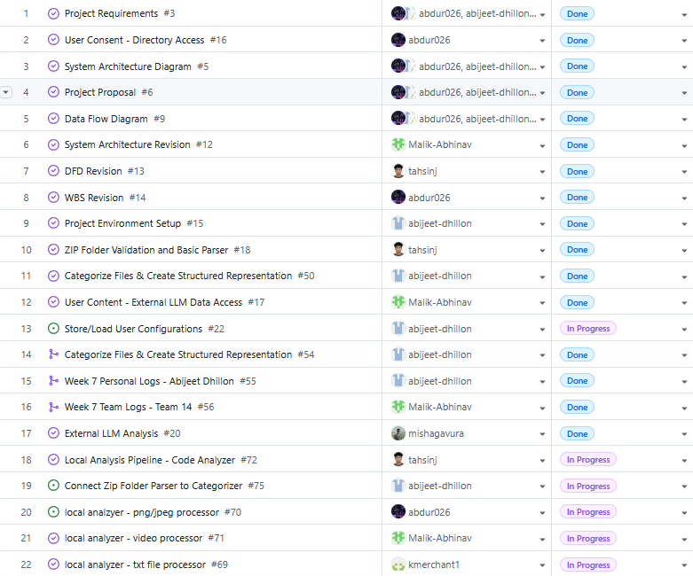
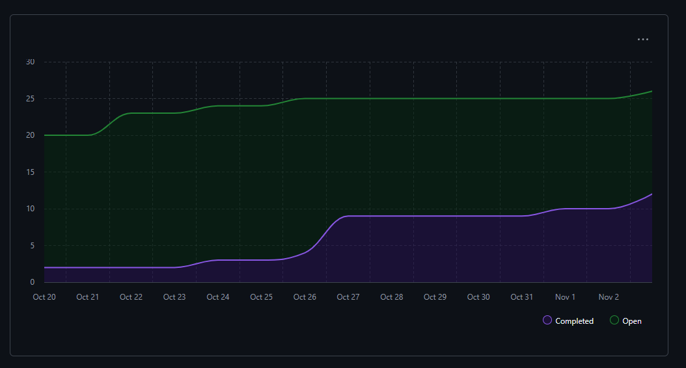
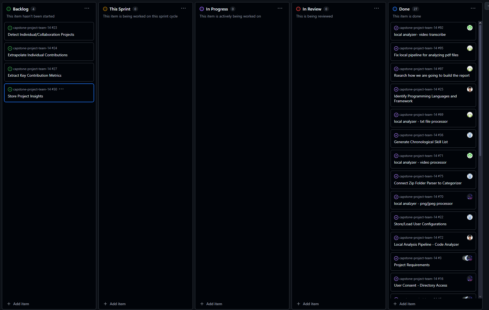

# Team 14 – Capstone Project Team Log

[Week 3 Team Logs](#week-3) 
[Week 4 Team Logs](#week-4) 
[Week 5 Team Logs](#week-5) 
[Week 6 Team Logs](#week-6) 
[Week 7 Team Logs](#week-7) 
[Week 8 Team Logs](#week-8)

## Week 3

### September 15 to September 21

### 1. Milestone Goals Recap

- Planned Features for This Milestone:
  - Create project requirements document
  - Set up project repository
  - Set up Kanban project board
- Tasks from Project Board Associated with These Features
  - N/A (Kanban board setup completed this week)

### 2. Burnup Chart

### 3. Username → Student Name Mapping

| GitHub Username | Student Name    |
| --------------- | --------------- |
| abijeet-dhillon | Abijeet Dhillon |
| tahsinj         | Tahsin Jawwad   |
| kmerchant1      | Kaiden Merchant |
| Malik-Abhinav   | Abhinav Malik   |
| abdur026        | Abdur Rehman    |
| mishgGavura     | Misha Gavura    |

### 4. Completed Tasks

### 5. In Progress Tasks

| Task ID | Issue Title | Username | Associated Feature |
| ------- | ----------- | -------- | ------------------ |
| N/A     | N/A         | N/A      | N/A                |

### 6. Test Report

N/A

### 7. Additional Context

This week focused on foundational project setup work. The team created the project requirements document, initialized the repository, and set up the Kanban project board on GitHub.

Future weeks will include more detailed documentation of tasks as work progresses.

---

## Week 4

### September 21 to September 28

### 1. Milestone Goals Recap

- Planned Features for This Milestone:
  - Create system architecture diagram
  - Create project proposal
- Tasks from Project Board Associated with These Features
  - N/A

### 2. Burnup Chart

### 3. Username → Student Name Mapping

| GitHub Username | Student Name    |
| --------------- | --------------- |
| abijeet-dhillon | Abijeet Dhillon |
| tahsinj         | Tahsin Jawwad   |
| kmerchant1      | Kaiden Merchant |
| Malik-Abhinav   | Abhinav Malik   |
| abdur026        | Abdur Rehman    |
| mishgGavura     | Misha Gavura    |

### 4. Completed Tasks

### 5. In Progress Tasks

| Task ID | Issue Title | Username | Associated Feature |
| ------- | ----------- | -------- | ------------------ |
| N/A     | N/A         | N/A      | N/A                |

### 6. Test Report

N/A

### 7. Additional Context

This week the team focused on defining the scope of the project and capturing the high-level architecture. The main deliverables were the **project proposal** and the **system architecture design diagram**. Future weeks will include more detailed task breakdowns and tracking via the Kanban board.

---

## Week 5

### September 29 to October 5

### 1. Milestone Goals Recap

- Planned Features for This Milestone:
  - Create level 0 data flow diagram
  - Create level 1 data flow diagram
- Tasks from Project Board Associated with These Features
  - N/A

### 2. Burnup Chart

### 3. Username → Student Name Mapping

| GitHub Username | Student Name    |
| --------------- | --------------- |
| abijeet-dhillon | Abijeet Dhillon |
| tahsinj         | Tahsin Jawwad   |
| kmerchant1      | Kaiden Merchant |
| Malik-Abhinav   | Abhinav Malik   |
| abdur026        | Abdur Rehman    |
| mishgGavura     | Misha Gavura    |

### 4. Completed Tasks

### 5. In Progress Tasks

| Task ID | Issue Title | Username | Associated Feature |
| ------- | ----------- | -------- | ------------------ |
| N/A     | N/A         | N/A      | N/A                |

### 6. Test Report

N/A

### 7. Additional Context

This week the team focused on researching and learning about data flow diagrams, which helped in the creation of our level 0 and level 1 data flow diagrams for the project. The main delivarables were the level 0 and level 1 data flow diagrams. We also discussed the differences between our data flow diagrams with other groups in class to gain a better understanding of how we could imporve our own data flow diagrams.

---

## Week 6

### October 6 to October 12

### 1. Milestone Goals Recap

- Revised the System Architecture Diagram
- Revised the Level 1 Data Flow Diagram
- Revised the WBS
- Initialised Project Environment
- Tasks from Project Board Associated with These Features
  - System Architecture Revision
  - DFD Revision
  - WBS Revision
  - Project Environment Setup

### 2. Burnup Chart

### 3. Username → Student Name Mapping

| GitHub Username | Student Name    |
| --------------- | --------------- |
| abijeet-dhillon | Abijeet Dhillon |
| tahsinj         | Tahsin Jawwad   |
| kmerchant1      | Kaiden Merchant |
| Malik-Abhinav   | Abhinav Malik   |
| abdur026        | Abdur Rehman    |
| mishgGavura     | Misha Gavura    |

### 4. Completed Tasks

### 5. In Progress Tasks

| Task ID | Issue Title | Username | Associated Feature |
| ------- | ----------- | -------- | ------------------ |
| N/A     | N/A         | N/A      | N/A                |

### 6. Test Report

N/A

### 7. Additional Context

This sprint focused more on understanding the full requirements, revising docs, and setting up the project environment.

---

## Week 7

### October 13 2025 to October 19 2025

### 1. Milestone Goals Recap

This week’s milestone focused on implementing and validating several core backend components that support data ingestion and structured representation of project files:

- (#18) Zip Folder Validation and Basic Parser
- (#50) Categorize Files & Create Structured Representation
- (#16) User Consent – Directory Access
- (#17) User Consent – External LLM Data Access
- (#20) External LLM analysis

The goal was to extend the parsing layer so that all team members can validate and categorize project data in a reproducible, Dockerized environment.

### 2. Burnup Chart

### 3. Username → Student Name Mapping

| GitHub Username | Student Name    |
| --------------- | --------------- |
| abijeet-dhillon | Abijeet Dhillon |
| tahsinj         | Tahsin Jawwad   |
| kmerchant1      | Kaiden Merchant |
| Malik-Abhinav   | Abhinav Malik   |
| abdur026        | Abdur Rehman    |
| mishgGavura     | Misha Gavura    |

### 4. Completed Tasks

### 5. In Progress Tasks

| Task ID | Issue Title                    | Username        | Associated Feature                       |
| ------- | ------------------------------ | --------------- | ---------------------------------------- |
| 22      | Store/Load User Configurations | abijeet-dhillon | Store User Configurations for Future Use |

### 6. Test Report

All pytest suites passed successfully this week.

- Tests implemented for Zip Folder Validation and Basic Parser (#18)
- Tests implemented for Categorize Files & Create Structured Representation (#50)
- Tests implemented for User Consent – Directory Access (#16)
- Tests implemented for User Consent – External LLM Data Access (#17)

### 7. Future Cycle Plans

To build upon this cycle’s work and address identified challenges, the team will:

- Set up the analysis pipeline to connect the parsing and categorization layers into a unified data flow.
- Implement storing/loading of user configurations to handle environment differences between Docker and local setups.
- Detect individual vs. collaborative projects to enable contribution tracking in later stages.
- Extrapolate individual contributions for analytical visualization in upcoming milestones.
- Break down these larger tasks into smaller sub-issues to improve clarity and workload distribution.

### 8. Reflection on This Cycle

What went well:

- The team made strong progress on foundational backend functionality. We successfully implemented the zip folder validation, basic parser, and file categorization system that generates a structured representation of the project’s folder hierarchy. These features were integrated smoothly into the existing backend and passed all associated tests.

What didn’t go as well:

- Time management was a challenge this week due to multiple academic commitments — specifically, studying and preparation for ongoing midterms (including this course's quiz) reduced the amount of time available to work toward issues. This caused slower progress on project features, which will carry over into the next cycle.

How this informs next cycle:

- To maintain steady momentum, the next cycle’s plan includes subdividing large tasks and setting clearer priorities early in the week. This will ensure that high-priority features receive consistent progress even during heavier academic weeks.

## Week 8

### October 20 2025 to October 26 2025

### 1. Milestone Goals Recap

This week’s milestone focused on expanding the Local Analysis Pipeline with specialized analyzers for multiple file types. Team members developed and tested modules as part of the unified local analyzer framework.

- (#72) Local Analysis Pipeline – Code Analyzer
- (#71) Local Analyzer – Video Processor
- (#70) Local Analyzer – PNG/JPEG Processor
- (#69) Local Analyzer – TXT File Processor
- (#75) Connect Zip Folder Parser to Categorizer
- (#22) Store/Load User Configurations

The goal for this milestone was to implement standalone analyzers capable of scanning local artifacts, extracting metadata, and preparing structured outputs for later integration into the full analysis pipeline.

---

### 2. Burnup Chart

---

### 3. Username → Student Name Mapping

| GitHub Username | Student Name    |
| --------------- | --------------- |
| abijeet-dhillon | Abijeet Dhillon |
| tahsinj         | Tahsin Jawwad   |
| kmerchant1      | Kaiden Merchant |
| Malik-Abhinav   | Abhinav Malik   |
| abdur026        | Abdur Rehman    |
| mishgGavura     | Misha Gavura    |

---

### 4. Completed / In Progress Tasks

| Task ID | Issue Title                              | Username        | Associated Feature                       | Status    |
| ------- | ---------------------------------------- | --------------- | ---------------------------------------- | --------- |
| 22      | Store/Load User Configurations           | abijeet-dhillon | Store User Configurations for Future Use | Completed |
| 72      | Local Analysis Pipeline – Code Analyzer  | tahsinj         | Code Analyzer                            | Completed |
| 71      | Local Analyzer – Video Processor         | Malik-Abhinav   | Video Analyzer                           | Completed |
| 70      | Local Analyzer – PNG/JPEG Processor      | abdur026        | Image Analyzer                           | Completed |
| 69      | Local Analyzer – TXT File Processor      | kmerchant1      | Text Analyzer                            | Completed |
| 75      | Connect Zip Folder Parser to Categorizer | abijeet-dhillon | Parser Integration                       | Completed |

---

### 5. Test Report

All automated tests for the new analyzer modules passed successfully.

- ✅ Code Analyzer — 97% test coverage with comprehensive unit tests
- ✅ Video Analyzer — 97% test coverage, validated with CLI output
- ✅ Image Analyzer — verified image metadata extraction and format detection
- ✅ Text Analyzer — validated text parsing and tokenization
- ✅ Integration with categorizer under active development
- ✅ Storing and loading user configurations

Each analyzer was tested using pytest with coverage reports, and manual CLI validation was performed where applicable.

---

### 6. Additional Context

This week marked a major milestone — completing the core components of the Local Analysis Layer, which now supports multiple file formats.  
The analyzers share a consistent design pattern, making future integration into the categorization and visualization modules straightforward. We also connected the parser to the categorizer and implemented a user configuration storage system.

The team also worked on documenting testing procedures and improving module readability to support easier collaboration and merging.

---

### 7. Future Cycle Plans

- Begin integrating all analyzers into a unified local pipeline that communicates with the central categorizer.
- Implement JSON serialization for analysis results to prepare for database connection.
- Conduct end-to-end testing across analyzers to ensure consistent output schemas.
- Prepare documentation and example demonstrations for milestone review.

---

### 8. Reflection on This Cycle

What went well:

- Strong progress across all assigned analyzers, every module compiles, runs, and passes tests.
- Team members followed a consistent structure and naming convention, which simplifies future integration.
- CLI testing confirmed that the analyzers handle both valid and invalid files gracefully.

What could be improved:

- Cross-analyzer integration needs more coordination, next sprint will focus on ensuring interoperability and consistent metrics formats.

How this informs us for the next cycle:

- Overall, this sprint was productive — we now have a basic foundation for the Local Analysis Pipeline. The core analyzers for different file types are in place and functioning individually. We also have an initial user configuration storage system.
- In the next cycle, we plan to connect these modules together, introduce a database layer, and expand the analysis capabilities to provide deeper, more integrated insights across all local artifacts.

## Week 9

### October 27 2025 to November 2 2025

### 1. Milestone Goals Recap

This week’s milestone focused on improving the Local Analysis Pipeline by implementing libraries and fixing previous issues. Team members developed and tested modules as part of the unified local analyzer framework.

- (#97) Rsearch how we are going to build the report
- (#95) Fix local pipeline for analyzing pdf files
- (#92) local analyzer- video transcribe
- (#25) Identify Programming Languages and Framework
- (#36) Generate Chronological Skill List

---

### 2. Burnup Chart

---

### 3. Username → Student Name Mapping

| GitHub Username | Student Name    |
| --------------- | --------------- |
| abijeet-dhillon | Abijeet Dhillon |
| tahsinj         | Tahsin Jawwad   |
| kmerchant1      | Kaiden Merchant |
| Malik-Abhinav   | Abhinav Malik   |
| abdur026        | Abdur Rehman    |
| mishgGavura     | Misha Gavura    |

---

### 4. Completed / In Progress Tasks

| Task ID | Issue Title                              | Username        | Associated Feature                       | Status    |
| ------- | ---------------------------------------- | --------------- | ---------------------------------------- | --------- |
| 92      | local analyzer- video transcribe           | Malik-Abhinav | Video Analyzer | Completed |
| 25      | Identify Programming Languages and Framework | tahsinj | Code Analyzer                      | Completed |
| 36      | Generate Chronological Skill List         | abijeet-dhillon |                       | Completed |
| 97      | Rsearch how we are going to build the report | kmerchant1 |                      | Completed |
| 95     | Fix local pipeline for analyzing pdf files | kmerchant1 | Text Analyzer                     | Completed |

---

### 5. Test Report

All automated tests for the updated modules passed successfully.

- Language and Framework Identification — 95 total tests passing with 71 new tests in a comprehensive unit tests
- Video Analyzer — 17 tests passing for the new implementation
- Generate Chronological Skill List — all tests implemented and passing

Each code feature was tested using pytest with coverage reports, and manual testing where needed.

---

### 6. Additional Context

This week focused on refining and extending the capabilities of the Local Analysis Pipeline through improved detection algorithms and enhanced video processing.

- Generalized the detection system into a dedicated module (`lang_frameworks.py`) that now supports 17 programming languages. The module uses improved parsing with optional libraries (Pygments, tomllib, requirements-parser) while maintaining graceful fallback behavior.
- Integrated Whisper-based audio transcription capabilities into the video analyzer, enabling extraction of spoken content from video files for richer artifact analysis.
- Implemented a system to generate chronological skill lists that track skill development over time.
- Resolved issues with PDF file analysis in the local pipeline, ensuring consistent handling of document artifacts.
- Improved photo analyzer.

The team maintained strong testing practices, with 95 total tests passing for the enhanced code analyzer (71 new tests) and 17 tests for the updated video analyzer. All new features follow TDD principles and integrate cleanly with existing modules.

---

### 7. Future Cycle Plans

- Integrate the enhanced code analyzer with git repository scanning to enable commit-level analysis and contribution tracking.
- Expand the pipeline to organize folder into distinct projects.
- Implement the report generation pipeline based on this week's research, establishing templates and output formats.
- Connect analyzer outputs to a unified data aggregation layer for cross-artifact insights.
- Develop visualization components for skill progression and contribution metrics.
- Begin database schema design for persistent storage of analysis results and user configurations.

---

### 8. Reflection on This Cycle

What went well:

- The team successfully enhanced core analysis capabilities while maintaining backward compatibility with existing code. The language/framework detection improvements significantly expand the range of projects we can analyze accurately.
- Strong adherence to TDD principles resulted in comprehensive test coverage, which gives confidence in the robustness of new features.
- Team coordination improved with successful merge resolution and integration of multiple concurrent feature branches without major conflicts.
- Research on report generation provided clear direction for upcoming deliverables.

What could be improved:

- Merge conflicts did occur once when integrating with the develop branch, highlighting the need for more frequent syncing with the main branch during development.
- Some features require additional optional dependencies, which adds complexity to the deployment and testing process — better documentation of dependencies is needed.
- Cross-module integration testing remains limited; we're testing components individually but not yet validating the full pipeline end-to-end.

How this informs us for the next cycle:

- The Local Analysis Pipeline is now mature enough to begin full integration work. Next cycle should focus on connecting all analyzers through a unified interface and implementing the data aggregation layer.
- We need to establish a consistent data schema across all analyzers to facilitate the report generation process and enable seamless integration.
- The team should prioritize end-to-end testing and documentation as we move from individual module development to full system integration.
- With the analysis foundation solid, we can shift focus toward user-facing features like report generation, visualization, and the frontend interface.
