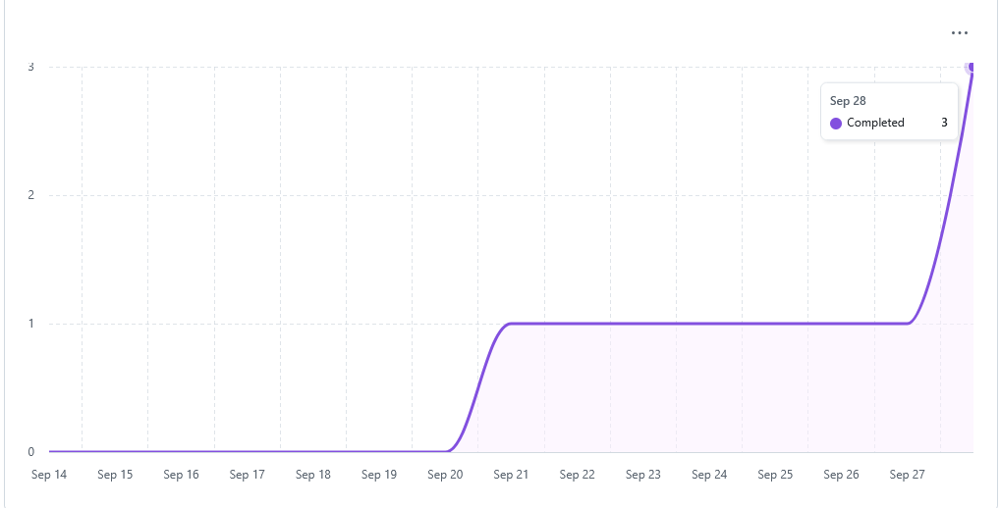
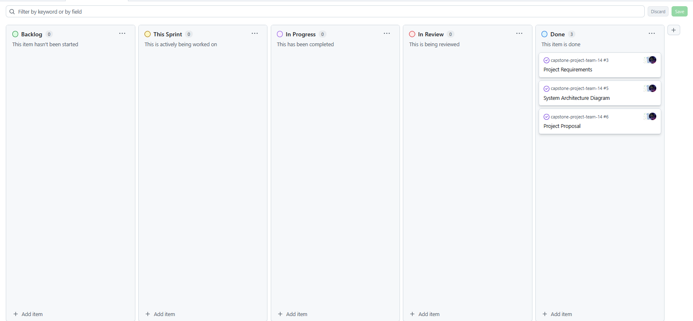
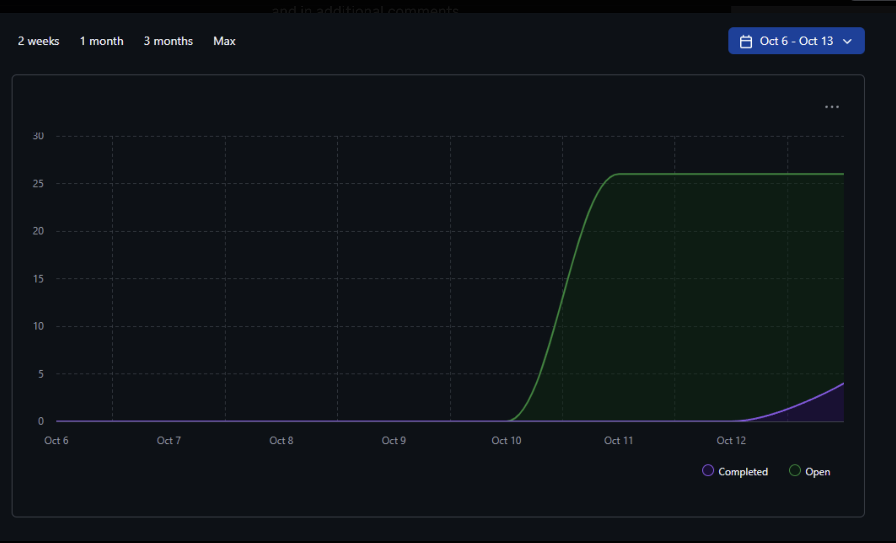
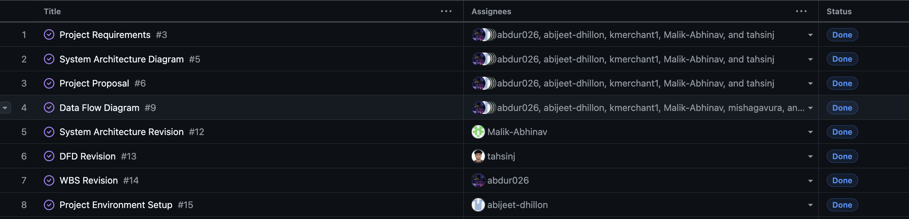

# Team 14 – Capstone Project Team Log 

[Week 3 Team Logs](#week-3) 
[Week 4 Team Logs](#week-4) 
[Week 5 Team Logs](#week-5)

## Week 3 
### September 15 to September 21

### 1. Milestone Goals Recap
- Planned Features for This Milestone:
  - Create project requirements document
  - Set up project repository
  - Set up Kanban project board
- Tasks from Project Board Associated with These Features
  - N/A (Kanban board setup completed this week)

### 2. Burnup Chart
  
N/A (tracking begins later)

### 3. Username → Student Name Mapping
| GitHub Username | Student Name |
|-----------------|-------------|
| abijeet-dhillon | Abijeet Dhillon |
| tahsinj | Tahsin Jawwad |
| kmerchant1 | Kaiden Merchant |
| Malik-Abhinav | Abhinav Malik |
| abdur026 | Abdur Rehman |
| username | name |

### 4. Completed Tasks

### 5. In Progress Tasks
| Task ID | Issue Title | Username | Associated Feature |
|--------|-------------|----------|-------------------|
| N/A    | N/A         | N/A      | N/A               |

### 6. Test Report
N/A

### 7. Additional Context
This week focused on foundational project setup work. The team created the project requirements document, initialized the repository, and set up the Kanban project board on GitHub.  

Future weeks will include more detailed documentation of tasks as work progresses.

---

## Week 4 
### September 21 to September 28

### 1. Milestone Goals Recap
- Planned Features for This Milestone:
  - Create system architecture diagram
  - Create project proposal
- Tasks from Project Board Associated with These Features
  - N/A

### 2. Burnup Chart
  

### 3. Username → Student Name Mapping
| GitHub Username | Student Name |
|-----------------|-------------|
| abijeet-dhillon | Abijeet Dhillon |
| tahsinj | Tahsin Jawwad |
| kmerchant1 | Kaiden Merchant |
| Malik-Abhinav | Abhinav Malik |
| abdur026 | Abdur Rehman |
| username | name |

### 4. Completed Tasks

### 5. In Progress Tasks
| Task ID | Issue Title | Username | Associated Feature |
|--------|-------------|----------|-------------------|
| N/A    | N/A         | N/A      | N/A               |

### 6. Test Report
N/A

### 7. Additional Context
This week the team focused on defining the scope of the project and capturing the high-level architecture. The main deliverables were the **project proposal** and the **system architecture design diagram**. Future weeks will include more detailed task breakdowns and tracking via the Kanban board.

---

## Week 5
### September 29 to October 5

### 1. Milestone Goals Recap
- Planned Features for This Milestone:
  - Create level 0 data flow diagram
  - Create level 1 data flow diagram
- Tasks from Project Board Associated with These Features
  - N/A

### 2. Burnup Chart
  

### 3. Username → Student Name Mapping
| GitHub Username | Student Name |
|-----------------|-------------|
| abijeet-dhillon | Abijeet Dhillon |
| tahsinj | Tahsin Jawwad |
| kmerchant1 | Kaiden Merchant |
| Malik-Abhinav | Abhinav Malik |
| abdur026 | Abdur Rehman |
| username | name |

### 4. Completed Tasks

### 5. In Progress Tasks
| Task ID | Issue Title | Username | Associated Feature |
|--------|-------------|----------|-------------------|
| N/A    | N/A         | N/A      | N/A               |

### 6. Test Report
N/A

### 7. Additional Context
This week the team focused on researching and learning about data flow diagrams, which helped in the creation of our level 0 and level 1 data flow diagrams for the project. The main delivarables were the level 0 and level 1 data flow diagrams. We also discussed the differences between our data flow diagrams with other groups in class to gain a better understanding of how we could imporve our own data flow diagrams.

---
## Week 6
### October 6 to October 12

### 1. Milestone Goals Recap
- Revised the System Architecture Diagram
- Revised the Level 1 Data Flow Diagram
- Revised the WBS
- Initialised Project Environment
- Tasks from Project Board Associated with These Features
  - System Architecture Revision
  - DFD Revision
  - WBS Revision
  - Project Environment Setup

### 2. Burnup Chart
  

### 3. Username → Student Name Mapping
| GitHub Username | Student Name |
|-----------------|-------------|
| abijeet-dhillon | Abijeet Dhillon |
| tahsinj | Tahsin Jawwad |
| kmerchant1 | Kaiden Merchant |
| Malik-Abhinav | Abhinav Malik |
| abdur026 | Abdur Rehman |
| username | name |

### 4. Completed Tasks

### 5. In Progress Tasks
| Task ID | Issue Title | Username | Associated Feature |
|--------|-------------|----------|-------------------|
| N/A    | N/A         | N/A      | N/A               |

### 6. Test Report
N/A

### 7. Additional Context
