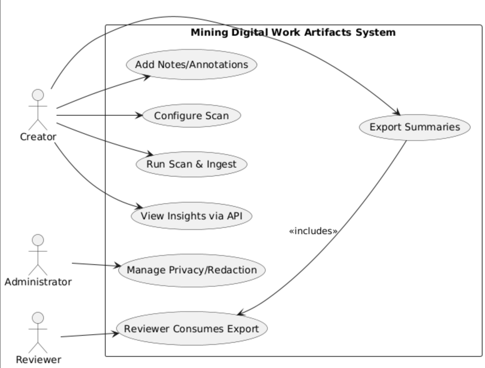

# Features Proposal for Project Option: Mining Digital Work Artifacts

**Team Number:** 14  
**Team Members:** Tahsin Jawwad SN43291889, Abijeet Dhillon SN43227198

---

## 1. Project Scope and Usage Scenario
Creators (graduating students or early professionals) want a privacy-first way to scan selected folders on their own machines to mine digital work artifacts (code repositories, documents, slides, and media/design files) and produce highlights and portfolio summaries; Administrators (the local machine owner, often the same person) configure and consent to scanning policies such as allowlists/denylists and redaction, while Reviewers (instructors, mentors, hiring managers) never access raw files but consume exported summaries (JSON/CSV/PDF) produced by the system. The typical flow is that a Creator configures a scan, the system parses and normalizes artifact metadata locally, computes insights such as contribution timelines and document activity, stores them locally, and then the Creator exports a concise report for Reviewers.

---

## 2. Proposed Solution
We will implement a local-first pipeline with three components: (1) a Scanner that enumerates files from user-approved folders and detects types; (2) Adapters for key artifact classes (Git repositories via GitPython/pydriller; Office/PDF via `python-docx`/`python-pptx`/`pdfminer`; basic media/design metadata via `ffprobe` or equivalent); and (3) a FastAPI service that exposes REST endpoints for artifacts and insights. Processing and storage remain local by default to protect privacy, and the API will be consumed by a dashboard in Term 2.

Our value proposition is a privacy-first, testable, and extensible architecture that surfaces meaningful signals (commit velocity, project timelines, document activity) in a deterministic way; compared to other teams, we emphasize: (a) a plug-in adapter interface that makes file-type support straightforward to extend, (b) robust PII redaction before storage, and (c) a full requirements→tests traceability matrix to ensure verifiability from the outset.

---

## 3. Use Cases

### Use Case 1: Configure Scan
- **Primary actor:** Creator  
- **Description:** Select folders to scan and set scanning/redaction preferences.  
- **Precondition:** Application installed locally; Creator has access to target folders.  
- **Postcondition:** A scan configuration with allowlists/denylists, size caps, and redaction rules is saved.  
- **Main Scenario:**
  1. Creator opens app and chooses “Configure Scan.”
  2. Creator selects one or more folders (e.g., `./Projects`, external drive).
  3. Creator sets file-type limits, max file size, and exclusion patterns.
  4. Creator reviews default redaction rules and adjusts as needed.
  5. System validates access and saves configuration.
- **Extensions:**
  - Folder not accessible: system displays error and suggests alternatives.
  - Conflicting rules: system highlights conflicts and asks for resolution.

### Use Case 2: Run Scan & Ingest
- **Primary actor:** Creator  
- **Description:** Enumerate files, parse artifacts via adapters, normalize and deduplicate, apply redaction, and persist locally.  
- **Precondition:** A valid scan configuration exists.  
- **Postcondition:** Normalized artifacts and derived metrics are stored in the local DB with an audit log.  
- **Main Scenario:**
  1. Creator clicks “Run Scan.”
  2. System enumerates files and detects types.
  3. Adapters extract metadata/content summaries (Git stats, doc word/page counts, media duration).
  4. System normalizes, deduplicates by hash, and applies redaction.
  5. System writes records to DB and emits progress status.
- **Extensions:**
  - Timeout on large files: system skips with warning and continues.
  - Duplicate files detected: single canonical record retained.

### Use Case 3: View Insights via API
- **Primary actor:** Creator  
- **Description:** Query local API for artifacts, timelines, and summary insights.  
- **Precondition:** Scan has completed successfully.  
- **Postcondition:** Creator receives JSON responses for artifacts and insights.  
- **Main Scenario:**
  1. Creator requests summary endpoint (e.g., `/insights/summary`).
  2. System aggregates metrics (contribution heatmap, streaks).
  3. System returns JSON with totals and timelines.
- **Extensions:**
  - Empty dataset: system returns empty arrays with guidance to run a scan.

### Use Case 4: Export Summaries
- **Primary actor:** Creator  
- **Description:** Export selected insights as JSON/CSV/PDF for Reviewers.  
- **Precondition:** Insights exist in the DB.  
- **Postcondition:** Exported file is generated locally.  
- **Main Scenario:**
  1. Creator selects export format and scope (time window/projects).
  2. System formats and writes the export to a chosen location.
  3. System confirms completion and path to file.
- **Extensions:**
  - Path not writable: system prompts for another/default location.

### Use Case 5: Manage Privacy/Redaction
- **Primary actor:** Administrator  
- **Description:** Configure redaction policies and retention; purge data on request.  
- **Precondition:** Admin access to the local instance.  
- **Postcondition:** Policies are updated; data purged if requested.  
- **Main Scenario:**
  1. Admin opens Privacy settings.
  2. Admin edits redaction regexes and retention windows.
  3. System revalidates rules and saves.
- **Extensions:**
  - Invalid regex: system highlights error and suggests a fix.

### Use Case 6: Add Notes/Annotations

- **Primary actor:** Creator  
- **Description:** Attach personal notes or reflections to a project or artifact.  
- **Precondition:** Artifact exists in the local database.  
- **Postcondition:** Note is stored and associated with the artifact.  

**Main Scenario:**  
1. Creator selects an artifact from the list of scanned items.  
2. Creator chooses “Add Note.”  
3. Creator writes a note and saves it.  
4. System stores the note linked to the artifact.  
5. System confirms successful save.  

**Extensions:**  
- Empty note submitted → system rejects and prompts for valid input.  
- Artifact deleted before save → system displays error and cancels operation.  

---

### Use Case 7: Reviewer Consumes Export

- **Primary actor:** Reviewer  
- **Description:** Reviewer opens and reviews an exported portfolio summary without accessing raw files.  
- **Precondition:** Export file (JSON/CSV/PDF) has been generated by the Creator.  
- **Postcondition:** Reviewer is able to view structured insights and summaries.  

**Main Scenario:**  
1. Reviewer receives the exported file from the Creator.  
2. Reviewer opens the file in a suitable application (e.g., Excel for CSV, PDF reader).  
3. Reviewer reviews contributions, timelines, and summaries.  

**Extensions:**  
- Export file is missing or corrupted → Reviewer cannot open and requests Creator to regenerate.  
- Reviewer requests more detail → Creator reconfigures export and generates a new file.  

---

## 4. Requirements, Testing, Requirement Verification

**Technology stack & test framework:** Python 3.11, FastAPI, GitPython/pydriller, `python-docx`/`python-pptx`/`pdfminer`, optional `ffprobe`; testing with `pytest` (unit/integration), FastAPI `TestClient`, coverage via `pytest-cov`, GitHub Actions CI.

## Requirements, Testing, and Verification

### Requirements Table

| Requirement | Description | Test Cases | Who | H/M/E |
|---|---|---|---|---|
| R1 Directory Selection & Policy | User can select folders; set allow/deny patterns, size caps | **Positive:** TC1.1 Select valid folder → config saved. TC1.2 Allow/deny filters apply correctly. **Negative:** TC1.3 Unreadable folder → error. TC1.4 Conflicting rules → warning. | **Tahsin Jawwad** | M |
| R2 Type Detection | Detect file types via extension/magic, skip unsupported | **Positive:** TC2.1 Supported file detected. TC2.2 Mixed input → only supported kept. **Negative:** TC2.3 Unsupported file skipped w/ warning. TC2.4 Corrupt header → fallback or skip. | **Misha** | M |
| R3 Git Adapter | Extract commits, authorship, churn | **Positive:** TC3.1 Small repo → commit count matches `git log`. TC3.2 Author list extracted. **Negative:** TC3.3 Missing `.git/` folder → error. TC3.4 Huge repo → timeout handled. | **Abijeet Dhillon** | H |
| R4 Office/PDF Adapter | Parse Word, PPT, PDF for counts & metadata | **Positive:** TC4.1 Word file word count accurate. TC4.2 PDF page count correct. **Negative:** TC4.3 Corrupt file → error logged. TC4.4 Missing metadata handled safely. | **Abhinav Malik** | M |
| R5 Media/Design Adapter | Extract duration, resolution/dimensions | **Positive:** TC5.1 Video duration correct. TC5.2 Image width/height detected. **Negative:** TC5.3 Corrupt file skipped w/ warning. TC5.4 Unsupported format skipped. | **Kaiden Merchant** | M |
| R6 Storage Layer | Persist normalized entities; migrations | **Positive:** TC6.1 Insert + retrieve artifact. TC6.2 Schema migration keeps data. **Negative:** TC6.3 Insert duplicate → deduped. TC6.4 Invalid ID query → error/null. | **Abdur Rehman** | M |
| R7 Analytics | Compute insights (timelines, streaks, totals) | **Positive:** TC7.1 Commit streak detected. TC7.2 Totals computed correctly. **Negative:** TC7.3 Empty dataset handled. TC7.4 Invalid input → error logged. | **Tahsin Jawwad** | M |
| R8 API Endpoints | REST endpoints for artifacts, insights, search | **Positive:** TC8.1 `/artifacts` returns valid schema. TC8.2 `/insights` matches DB. **Negative:** TC8.3 Invalid param → 400. TC8.4 Bad ID → 404. | **Abhinav Malik** | M |
| R9 Incremental Scan | Process only changed/new files | **Positive:** TC9.1 No changes → no new entries. TC9.2 Add new file detected once. **Negative:** TC9.3 Modify file → version updated. TC9.4 Deleted file not re-added. | **Misha** | M |
| R10 Export | Export insights to JSON/CSV/PDF | **Positive:** TC10.1 JSON export valid. TC10.2 CSV opens in Excel. **Negative:** TC10.3 Bad path → error. TC10.4 Corrupt DB → clean fail. | **Kaiden Merchant** | E |
| R11 Notes/Annotations | User can attach notes to projects | **Positive:** TC11.1 Add + retrieve note works. TC11.2 Delete removes note. **Negative:** TC11.3 Add note to missing artifact → error. TC11.4 Empty note rejected. | **Abijeet Dhillon** | E |
| R12 Privacy/Redaction Policies | Configure regexes, retention, and purge data | **Positive:** TC12.1 Add valid regex → saved. TC12.2 Retention window applied. **Negative:** TC12.3 Invalid regex → error. TC12.4 Purge request clears data. | **Abdur Rehman** | M |

---

### Workload Summary

- **Tahsin Jawwad** → R1 (M), R7 (M) → Config + analytics  
- **Abijeet Dhillon** → R3 (H), R11 (E) → Git + annotations  
- **Misha** → R2 (M), R9 (M) → Detection + incremental scan  
- **Abhinav Malik** → R4 (M), R8 (M) → Office/PDF parsing + API  
- **Kaiden Merchant** → R5 (M), R10 (E) → Media parsing + export  
- **Abdur Rehman** → R6 (M), R12 (M) → Storage + privacy/redaction  

---
